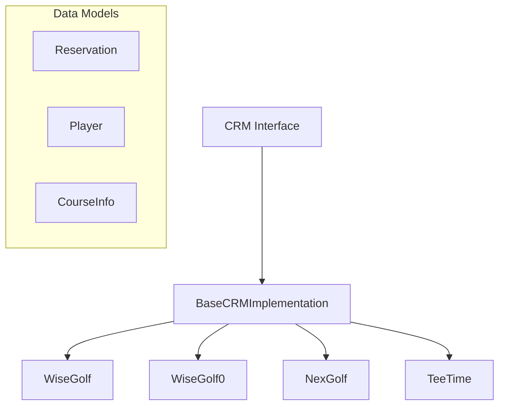

# CRM API Documentation

## Overview

GolfCal2 supports multiple golf club booking systems through a unified interface. Each system has its own API implementation while maintaining consistent data structures internally.

## Architecture



## Authentication Strategies

The system supports three main authentication strategies:

### 1. Token Authentication
Used by modern WiseGolf implementations.

Headers:
```http
Authorization: Bearer <jwt-token>
x-session-type: wisegolf
Accept: application/json, text/plain, */*
```

### 2. Cookie Authentication
Used by WiseGolf0 (legacy) and NexGolf systems.

WiseGolf0 format:
```http
Cookie: wisenetwork_session=<session_token>
Accept: application/json, text/plain, */*
Accept-Language: en-US,en;q=0.9
```

NexGolf format:
```http
Cookie: NGLOCALE=fi; JSESSIONID=<session_token>
Accept: application/json, text/plain, */*
```

### 3. API Key Authentication
Used by TeeTime system.

Headers:
```http
X-API-Key: <api_key>
X-Club-ID: <club_id>
Accept: application/json, text/plain, */*
```

## API Implementations

### 1. WiseGolf (Modern)

#### Authentication
```http
POST /auth/login
Content-Type: application/json

{
    "username": "your-username",
    "password": "your-password"
}
```

Response:
```json
{
    "token": "jwt-token",
    "expires_in": 3600
}
```

#### Get Reservations
```http
GET /reservations/my
Authorization: Bearer <token>
x-session-type: wisegolf
```

Response:
```json
{
    "success": true,
    "rows": [
        {
            "reservationTimeId": 91588,
            "dateTimeStart": "2025-01-05T11:00:00Z",
            "dateTimeEnd": "2025-01-05T13:00:00Z",
            "resourceId": 1,
            "firstName": "John",
            "familyName": "Doe",
            "clubAbbreviation": "GC",
            "handicapActive": "15.40",
            "productName": "Simulators",
            "variantName": "Simulator 1"
        }
    ]
}
```

### 2. WiseGolf0 (Legacy)

#### Get User Reservations
```http
GET /pd/simulaattorit/{product_id}/simulaattorit/?controller=ajax&reservations=getusergolfreservations
Cookie: wisenetwork_session=<session_token>
```

#### Get Flight Players
```http
GET /api/1.0/reservations/?productid={product_id}&date={date}&golf=1
Cookie: wisenetwork_session=<session_token>
```

### 3. NexGolf

#### Authentication
```http
POST /api/login
Content-Type: application/x-www-form-urlencoded

memberNumber=<member_id>&pin=<pin>
```

#### Get Reservations
```http
GET /api/reservations
Cookie: JSESSIONID=<session_token>
params:
  startDate: YYYY-MM-DD
  endDate: YYYY-MM-DD
```

Response:
```json
{
    "bookings": [
        {
            "startDateTime": "2024-01-01 10:00",
            "players": [
                {
                    "firstName": "John",
                    "lastName": "Doe",
                    "handicap": "15.4",
                    "club": {
                        "name": "Golf Club",
                        "code": "GC"
                    }
                }
            ],
            "bookingReference": "ABC123",
            "status": "confirmed"
        }
    ]
}
```

### 4. TeeTime

#### Authentication
Verify credentials:
```http
GET /api/verify
X-API-Key: <api_key>
X-Club-ID: <club_id>
```

#### Get Reservations
```http
GET /api/bookings
X-API-Key: <api_key>
X-Club-ID: <club_id>
params:
  member_id: <member_id>
```

Response:
```json
{
    "data": [
        {
            "teeTime": "2024-01-01 10:00:00",
            "players": [
                {
                    "firstName": "John",
                    "lastName": "Doe",
                    "handicap": 15.4,
                    "club": {
                        "name": "Golf Club",
                        "code": "GC"
                    }
                }
            ],
            "course": {
                "name": "Main Course",
                "holes": 18,
                "slope": 125
            }
        }
    ]
}
```

## Data Models

### Reservation
```python
@dataclass
class Reservation:
    datetime_start: datetime
    players: List[Player]
    course_info: Optional[CourseInfo] = None
    booking_reference: Optional[str] = None
    status: Optional[str] = None
```

### Player
```python
@dataclass
class Player:
    first_name: str
    family_name: str
    handicap: Optional[float] = None
    club_abbreviation: Optional[str] = None
```

### CourseInfo
```python
@dataclass
class CourseInfo:
    name: str
    holes: int = 18
    par: Optional[int] = None
```

## Error Handling

All APIs use standard HTTP status codes with additional details in response body:

### Authentication Errors (401)
```json
{
    "error": "authentication_failed",
    "message": "Invalid credentials"
}
```

### Rate Limiting (429)
```json
{
    "error": "too_many_requests",
    "message": "Rate limit exceeded",
    "retry_after": 60
}
```

### General Errors (400, 500)
```json
{
    "error": "error_code",
    "message": "Human readable message"
}
```

## Implementation Notes

### WiseGolf (Modern)
- JWT-based authentication
- Token expires after 1 hour
- Rate limit: 60 requests/minute
- Timezone: UTC in responses
- Real-time availability
- Extended course details

### WiseGolf0 (Legacy)
- Cookie-based authentication
- Session-based auth
- Basic functionality
- Local timezone in responses
- Flight grouping support (1-4 players per flight)

### NexGolf
- Cookie-based session
- Session expires after 24 hours
- Rate limit: 30 requests/minute
- Timezone: Local club timezone in responses
- Booking reference support
- Cart management

### TeeTime
- API key authentication
- No token expiration
- Rate limit: 100 requests/minute
- Timezone: Local club timezone in responses
- Rich course information
- Player grouping support

## Common Patterns

### Date Formats
- WiseGolf: ISO 8601 with timezone (UTC)
- WiseGolf0: "YYYY-MM-DD HH:MM:SS" (local)
- NexGolf: "YYYY-MM-DD HH:MM" (local)
- TeeTime: "YYYY-MM-DD HH:MM:SS" (local)

### Handicap Formats
- WiseGolf: Float
- WiseGolf0: String (needs conversion)
- NexGolf: String (needs conversion)
- TeeTime: Float

### Player Information
All APIs provide:
- First name
- Last name
- Handicap
- Home club

### Course Information
Common fields:
- Name
- Number of holes

Additional fields vary:
- WiseGolf: par
- WiseGolf0: variant name
- NexGolf: booking reference
- TeeTime: slope rating