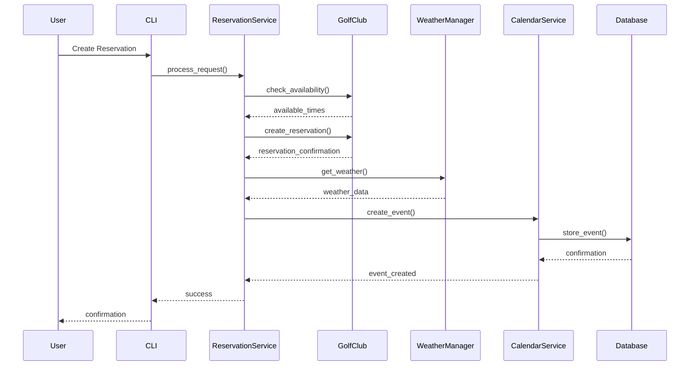
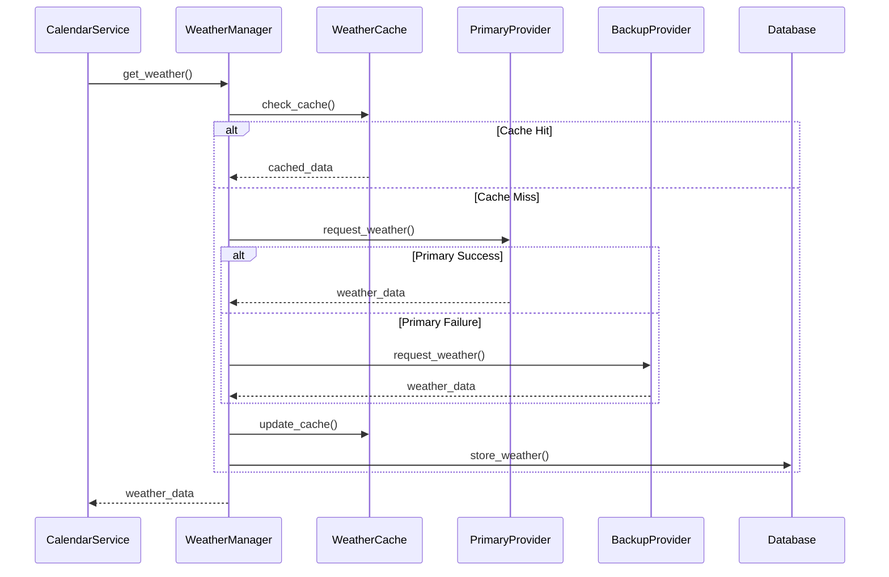
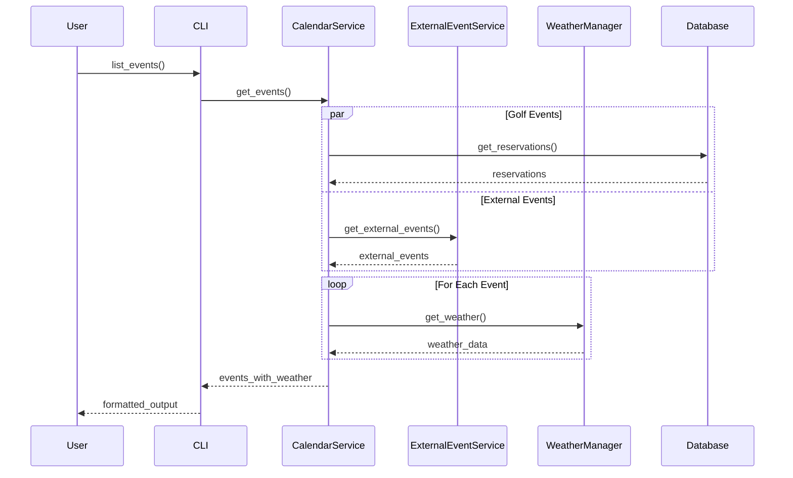
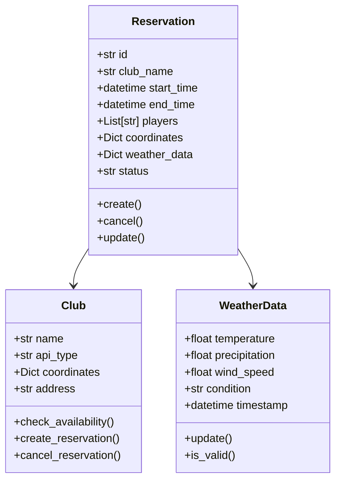
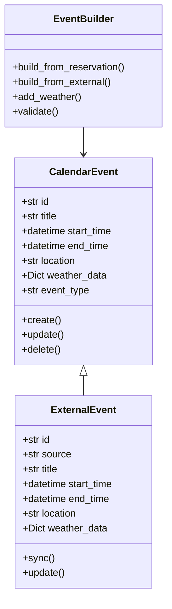
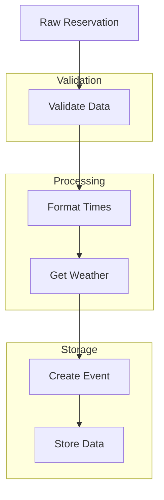
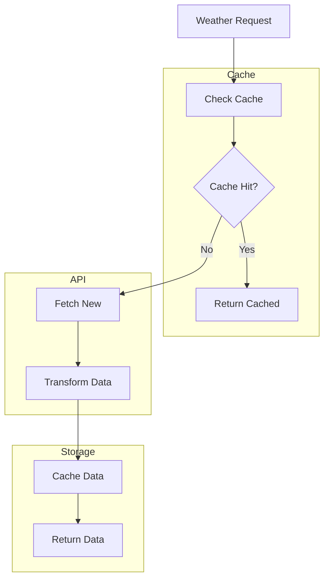
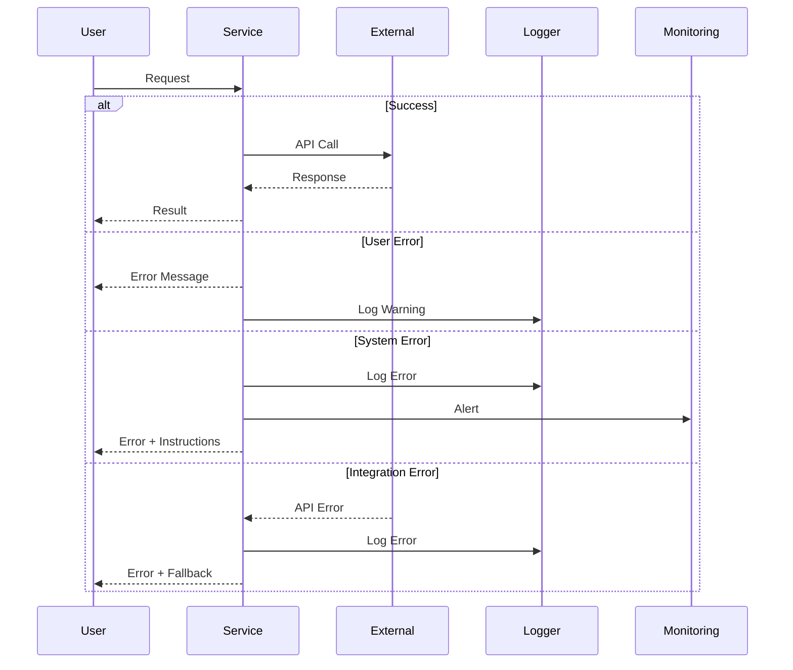

# Data Flow

## Overview

GolfCal2's data flow is designed to efficiently process golf reservations, integrate weather data, and manage calendar events. This document details the various data flows within the system.

## Reservation Flow



## Weather Integration Flow



## Calendar Event Flow



## Data Models

### Reservation Data



### Event Data



## Data Storage

### Database Schema

```sql
-- Reservations
CREATE TABLE reservations (
    id TEXT PRIMARY KEY,
    club_name TEXT NOT NULL,
    start_time TIMESTAMP NOT NULL,
    end_time TIMESTAMP NOT NULL,
    players TEXT NOT NULL,
    coordinates TEXT NOT NULL,
    weather_data TEXT,
    status TEXT NOT NULL,
    created_at TIMESTAMP DEFAULT CURRENT_TIMESTAMP
);

-- Weather Data
CREATE TABLE weather (
    id INTEGER PRIMARY KEY,
    latitude REAL NOT NULL,
    longitude REAL NOT NULL,
    temperature REAL,
    precipitation REAL,
    wind_speed REAL,
    condition TEXT,
    timestamp TIMESTAMP NOT NULL,
    created_at TIMESTAMP DEFAULT CURRENT_TIMESTAMP,
    UNIQUE(latitude, longitude, timestamp)
);

-- Calendar Events
CREATE TABLE events (
    id TEXT PRIMARY KEY,
    title TEXT NOT NULL,
    start_time TIMESTAMP NOT NULL,
    end_time TIMESTAMP NOT NULL,
    location TEXT,
    weather_data TEXT,
    event_type TEXT NOT NULL,
    source TEXT,
    created_at TIMESTAMP DEFAULT CURRENT_TIMESTAMP
);
```

## Data Transformations

### Reservation Processing



### Weather Processing



## Error Handling

### Error Flow



## Related Documentation

- [Architecture Overview](overview.md)
- [Service Architecture](services.md)
- [Database Schema](../deployment/database.md)
``` 