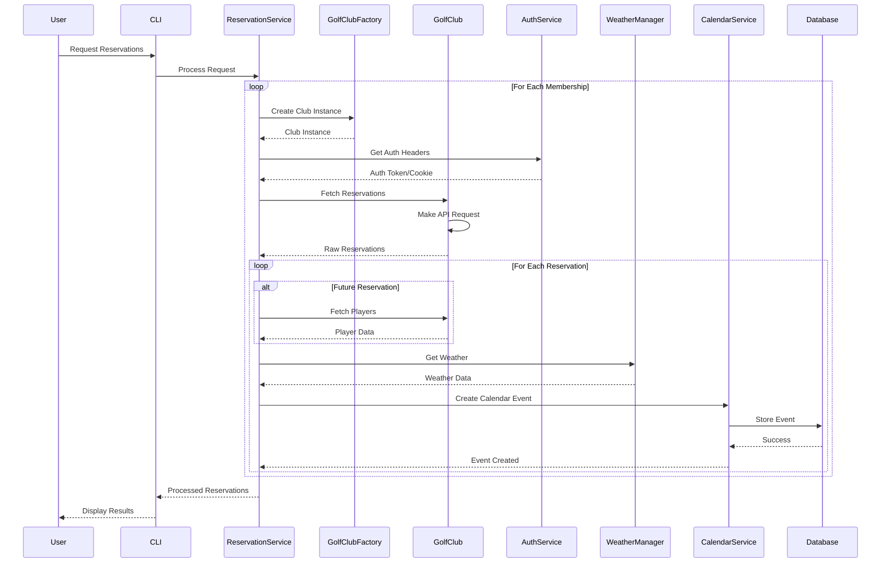
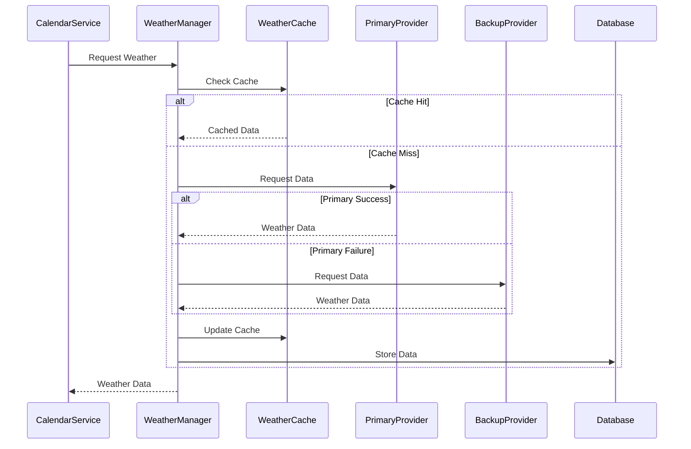
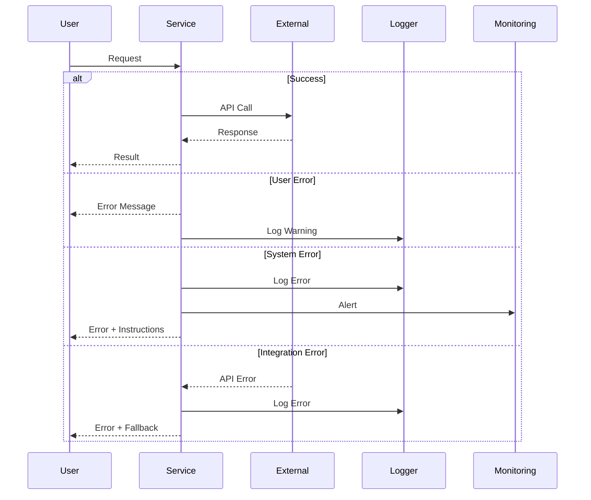
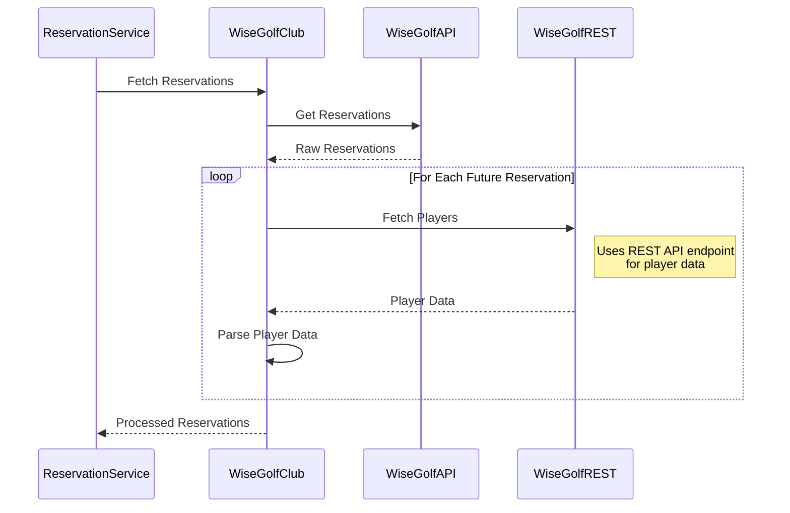
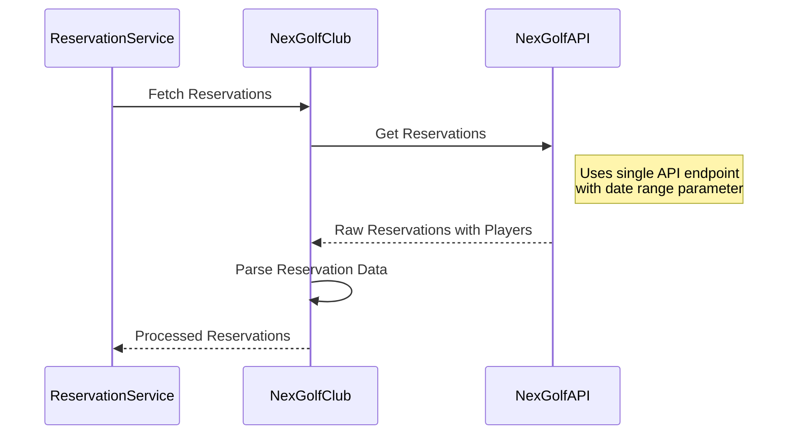

# Data Flow

## Overview

GolfCal2's data flow is designed to efficiently process golf reservations, integrate weather data, and manage calendar events. This document details the various data flows within the system.

## Reservation Flow



## Weather Flow



## Error Flow



## Golf Club System Flows

### WiseGolf Flow



### NexGolf Flow



### Key Differences

1. **Authentication**
   - WiseGolf: Token-based authentication with REST API
   - NexGolf: Cookie-based session authentication

2. **Player Data**
   - WiseGolf: Separate REST API call required for player data
   - NexGolf: Player data included in main reservation response

3. **Data Format**
   - WiseGolf: Two different API formats (AJAX and REST)
   - NexGolf: Single unified API format

4. **Date Handling**
   - WiseGolf: Server returns local times
   - NexGolf: Server returns UTC times with timezone info

5. **API Structure**
   - WiseGolf: Split between AJAX API (reservations) and REST API (players)
   - NexGolf: Single API endpoint with query parameters

## Related Documentation

- [Architecture Overview](overview.md)
- [Service Architecture](services.md)
- [Database Schema](../deployment/database.md)
```