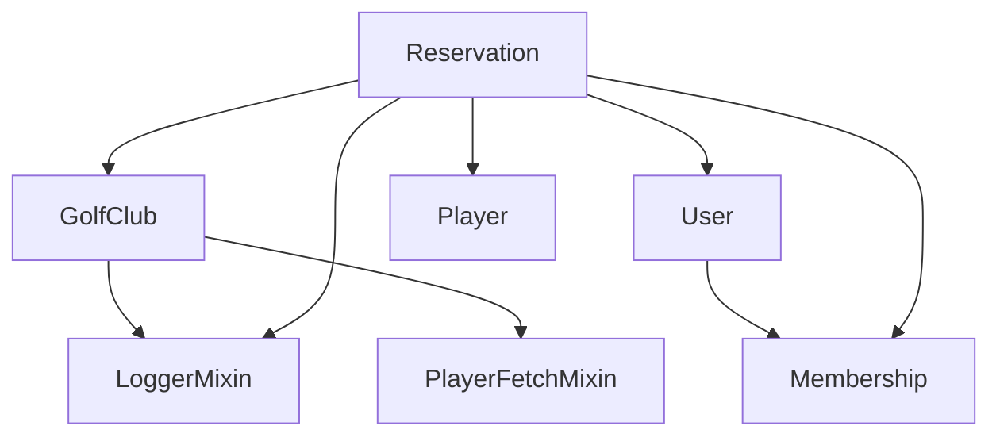

# Data Models

## Overview

GolfCal2 uses a comprehensive set of data models implemented as separate modules. Each model focuses on a specific domain and may include mixins for enhanced functionality.

## Core Models

### User Model (`models/user.py`)

```python
@dataclass
class User:
    """User model representing a golf calendar user."""
    name: str
    memberships: List[Membership]
    email: Optional[str] = None
    phone: Optional[str] = None
    handicap: Optional[float] = None

    def get_membership(self, club: str) -> Membership:
        """Get membership for specified club."""
        for membership in self.memberships:
            if membership.club == club:
                return membership
        raise ValueError(f"User {self.name} has no membership for club {club}")
```

### Membership Model (`models/membership.py`)

```python
@dataclass
class Membership:
    """Golf club membership details."""
    club: str
    clubAbbreviation: str
    duration: Dict[str, int]
    auth_details: Dict[str, str] = field(default_factory=dict)
```

### Golf Club Model (`models/golf_club.py`)

```python
@dataclass
class GolfClub(ABC, LoggerMixin):
    """Abstract base class for golf clubs."""
    name: str
    url: str
    address: str = "Unknown"
    timezone: str = "UTC"
    coordinates: Dict[str, float] = None
    variant: Optional[str] = None
    product: Optional[str] = None
    auth_service: Optional[AuthService] = None
    club_details: Optional[Dict[str, Any]] = None
    _tz_manager: Optional[TimezoneManager] = None

    @abstractmethod
    def fetch_reservations(self, membership: Membership) -> List[Dict[str, Any]]:
        """Fetch reservations for user with membership."""
        raise NotImplementedError
```

### Player Model (`models/reservation.py`)

```python
@dataclass
class Player:
    """Player details."""
    name: str
    club: str
    handicap: float

    @classmethod
    def from_wisegolf(cls, data: Dict[str, Any]) -> "Player":
        """Create Player instance from WiseGolf data."""
        first_name = data.get("firstName", "")
        family_name = data.get("familyName", "")
        club = data.get("clubAbbreviation", "N/A")
        handicap = float(data.get("handicapActive", 0.0))
        
        return cls(
            name=f"{first_name} {family_name}".strip(),
            club=club,
            handicap=handicap
        )
```

### Reservation Model (`models/reservation.py`)

```python
@dataclass
class Reservation(LoggerMixin):
    """Golf reservation."""
    club: GolfClub
    user: User
    membership: Membership
    start_time: datetime
    end_time: datetime
    players: List[Player]
    raw_data: Dict[str, Any]
    _tz_manager: Optional[TimezoneManager] = None

    def __post_init__(self):
        """Initialize after dataclass creation."""
        super().__init__()
        if self._tz_manager is None:
            self._tz_manager = TimezoneManager()
```

## Mixin Patterns

### Enhanced Logger Mixin (`utils/logging_utils.py`)

```python
class EnhancedLoggerMixin:
    """Enhanced mixin class to add advanced logging capabilities."""
    
    def __init__(self):
        """Initialize logger with correlation ID."""
        self._correlation_id = None
        self._log_context = {}
    
    def set_correlation_id(self, correlation_id: Optional[str] = None) -> None:
        """Set correlation ID for request tracking."""
        self._correlation_id = correlation_id or str(uuid.uuid4())
    
    def set_log_context(self, **kwargs) -> None:
        """Set additional context for logging."""
        self._log_context.update(kwargs)
    
    def debug(self, message: str, **kwargs) -> None:
        """Enhanced debug logging with context."""
        msg, _ = self._format_log_message(message, **kwargs)
        self.logger.debug(msg)
```

### Player Fetch Mixin (`models/mixins.py`)

```python
class PlayerFetchMixin(LoggerMixin):
    """Mixin for player fetching functionality."""
    
    def extract_players_from_response(
        self,
        response: Dict[str, Any],
        reservation: Dict[str, Any],
        skip_empty: bool = True,
        skip_reserved: bool = True
    ) -> List[Dict[str, Any]]:
        """Extract players from API response."""
        try:
            if response and 'rows' in response and 'reservationsGolfPlayers' in response:
                return self._extract_players_wisegolf(response, reservation, skip_empty, skip_reserved)
            elif response and 'reservationsGolfPlayers' in response:
                return self._extract_players_wisegolf0(response, skip_empty, skip_reserved)
            elif isinstance(response, list):
                return self._extract_players_from_list(response, skip_empty, skip_reserved)
            return []
        except Exception as e:
            self.logger.error(f"Failed to extract players: {e}")
            return []
```

### Request Handler Mixin (`models/mixins.py`)

```python
class RequestHandlerMixin:
    """Mixin for handling HTTP requests."""
    
    def _make_request(
        self,
        method: str,
        endpoint: str,
        params: Optional[Dict[str, str]] = None,
        data: Optional[Dict[str, Any]] = None,
        timeout: Optional[Tuple[int, int]] = (7, 20),
        retry_count: int = 3,
        retry_delay: int = 5,
        verify_ssl: bool = True
    ) -> Union[Dict[str, Any], List[Dict[str, Any]]]:
        """Make HTTP request with retries and error handling."""
        for attempt in range(retry_count):
            try:
                response = requests.request(
                    method,
                    endpoint,
                    params=params,
                    json=data,
                    timeout=timeout,
                    verify=verify_ssl
                )
                response.raise_for_status()
                return response.json()
            except Exception as e:
                if attempt == retry_count - 1:
                    raise
                time.sleep(retry_delay)
```

## Model Relationships



## Validation Rules

### Common Rules
1. Required Fields
   - Non-empty strings for names and identifiers
   - Valid club and membership references
   - Valid datetime values for reservations

2. Numeric Ranges
   - Handicap: -10 to 54 (validated in Player model)
   - Valid coordinates in GolfClub model

3. Dates and Times
   - Future dates for reservations
   - Valid timezone specifications
   - Proper date/time formats with timezone awareness

4. Relationships
   - User must have at least one membership
   - Reservation must have at least one player
   - Golf club must have valid URL and configuration

## Best Practices

1. Model Usage
   - Use dataclasses for model definitions
   - Implement `__post_init__` for validation
   - Use appropriate mixins for common functionality
   - Leverage class methods for factory patterns

2. Logging
   - Use EnhancedLoggerMixin for consistent logging
   - Set correlation IDs for request tracking
   - Include context in log messages
   - Handle errors with appropriate logging

3. API Integration
   - Use RequestHandlerMixin for HTTP requests
   - Implement proper retry logic
   - Handle API-specific data formats
   - Validate API responses

4. Error Handling
   - Raise specific exceptions
   - Include detailed error messages
   - Log errors with context
   - Handle validation errors gracefully
``` 