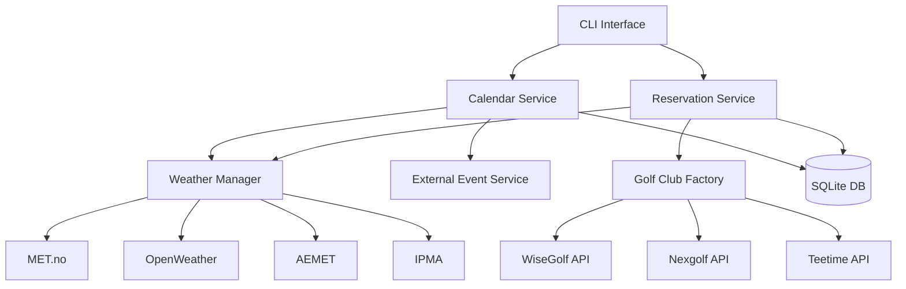
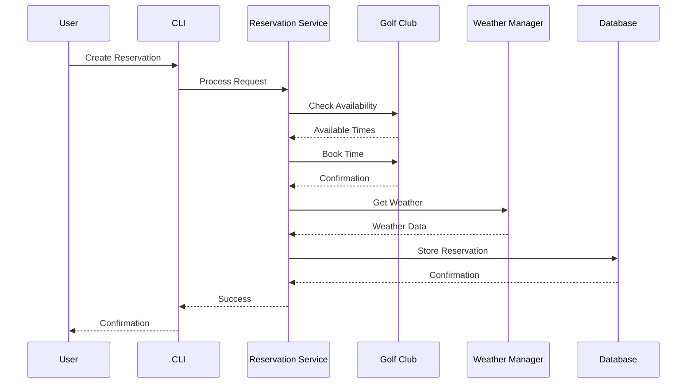
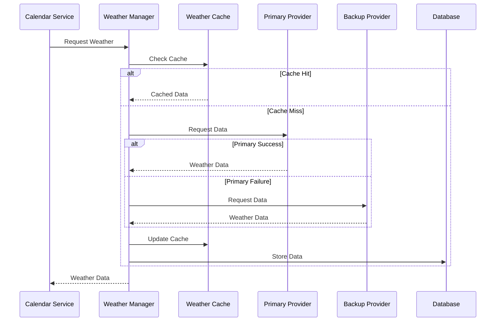
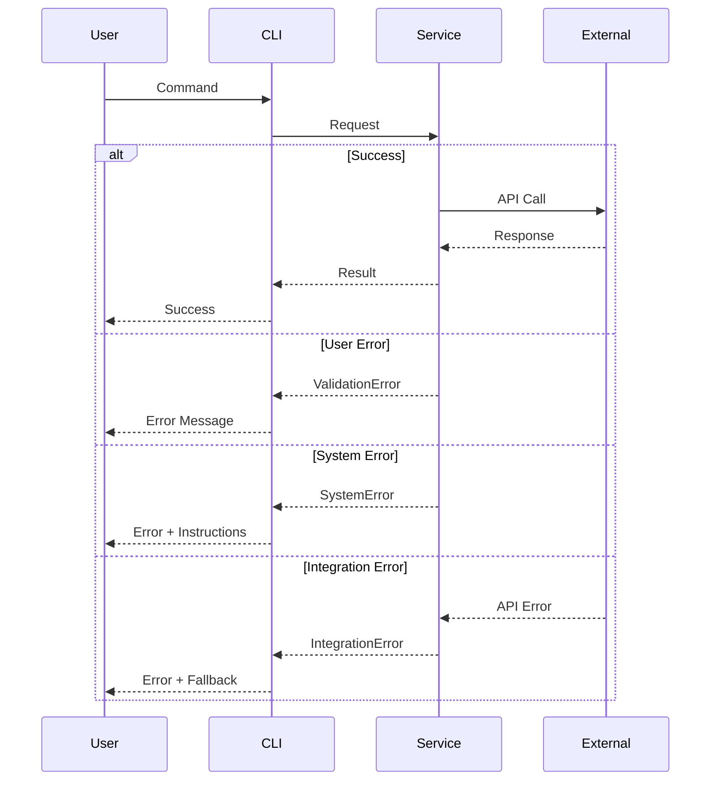

# GolfCal2 Architecture Overview

## Introduction

GolfCal2 is a command-line calendar application designed to manage golf reservations and events. It integrates with various golf club systems and weather services to provide comprehensive information about golf activities.

## System Architecture



## Core Components

### 1. Command Line Interface (CLI)
- Entry point for user interactions
- Handles command parsing and execution
- Manages user configuration
- Provides formatted output

### 2. Calendar Service
- Manages calendar events and reservations
- Integrates weather information
- Handles event conflicts
- Provides calendar views

### 3. Reservation Service
- Processes golf reservations
- Integrates with club systems
- Manages user memberships
- Handles booking confirmations

### 4. Weather Manager
- Coordinates weather services
- Caches weather data
- Handles provider fallback
- Normalizes weather formats

### 5. External Event Service
- Manages non-golf events
- Integrates with calendars
- Handles recurring events
- Provides event notifications

## Data Flow

### Reservation Flow



### Weather Integration Flow



## Configuration

### Application Config
```yaml
global:
  timezone: "Europe/Helsinki"
  log_level: "INFO"
  cache_dir: "~/.golfcal2/cache"

database:
  path: "~/.golfcal2/data.db"
  backup_dir: "~/.golfcal2/backups"

weather:
  primary: "met"
  backup: "openweather"
  cache_duration: 3600
  providers:
    met:
      user_agent: "GolfCal2/0.6.0"
    openweather:
      api_key: "your-key"
```

### User Config
```yaml
user:
  name: "John Doe"
  email: "john@example.com"
  timezone: "Europe/Helsinki"
  
memberships:
  - club: "Helsinki Golf"
    type: "wisegolf"
    auth:
      username: "john.doe"
      password: "secure-password"
  
  - club: "Espoo Golf"
    type: "nexgolf"
    auth:
      member_id: "12345"
      pin: "1234"
```

## Error Handling

### Error Types
1. **User Errors**
   - Invalid input
   - Missing configuration
   - Authentication failures

2. **System Errors**
   - Database errors
   - Network failures
   - Service unavailability

3. **Integration Errors**
   - API failures
   - Data format mismatches
   - Timeout errors

### Error Flow



## Security

### Authentication
- Secure credential storage
- API key management
- Session handling
- Token refresh

### Data Protection
- Encrypted storage
- Secure communication
- Data validation
- Access control

## Performance

### Caching Strategy
- Weather data caching
- Club data caching
- Configuration caching
- Cache invalidation

### Optimization
- Parallel requests
- Connection pooling
- Query optimization
- Resource cleanup

## Related Documentation

- [Service Architecture](services.md)
- [Data Flow](data-flow.md)
- [Configuration Guide](../deployment/configuration.md) 