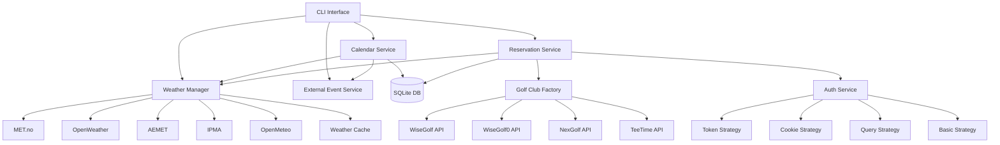
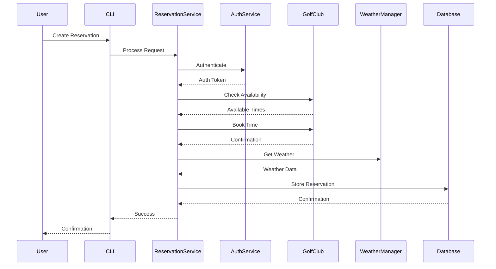
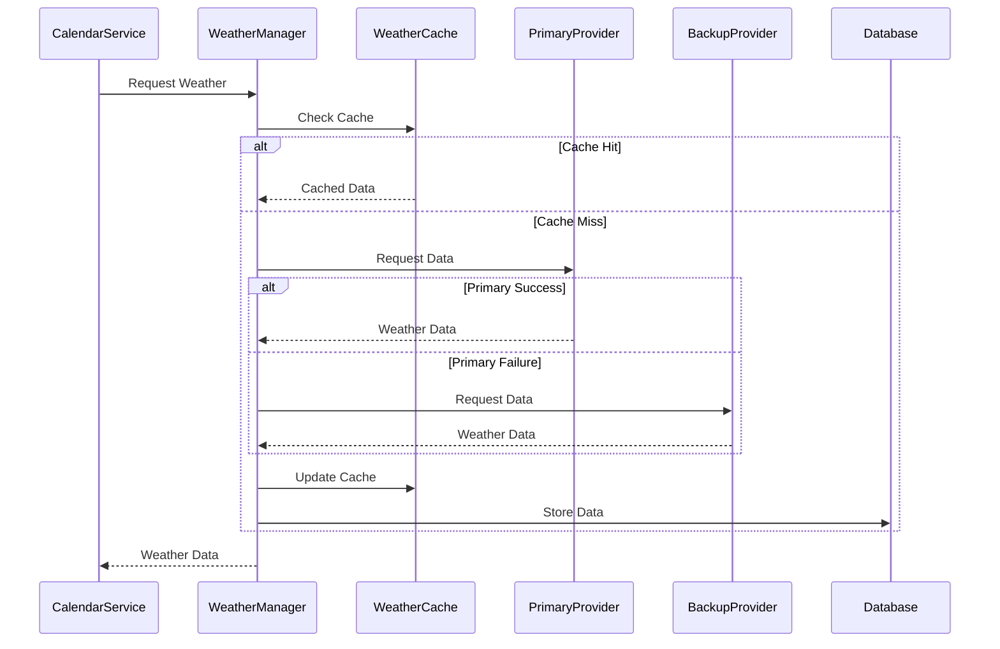
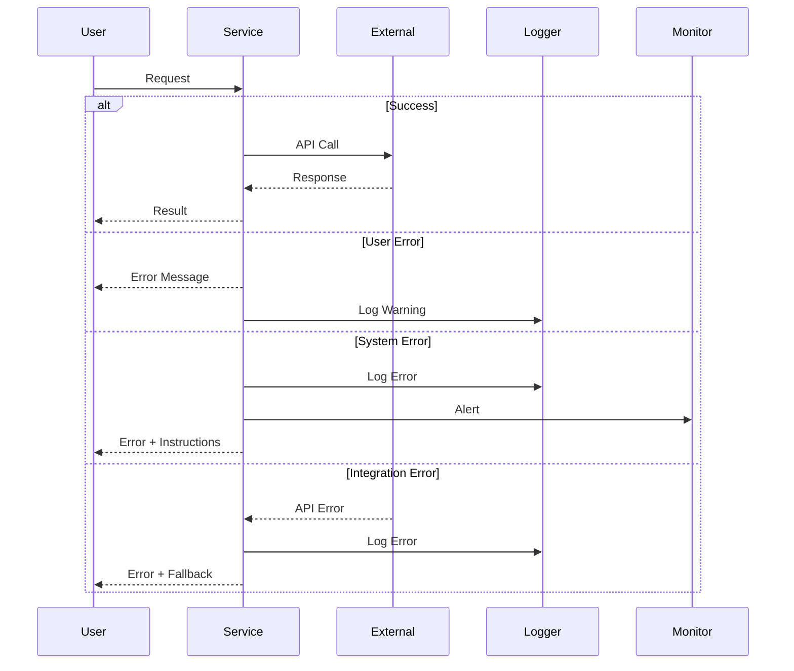

# GolfCal2 Architecture Overview

## Introduction

GolfCal2 is a command-line application designed to manage golf reservations and events. It integrates with multiple golf club booking systems, weather services, and calendar systems to provide comprehensive golf activity management.

## System Architecture



## Core Services

### 1. Calendar Service
- Manages calendar events and reservations
- Integrates weather information
- Handles event conflicts and overlaps
- Generates ICS calendar files
- Processes external events
- Components:
  - Calendar Builder
  - Reservation Builder
  - External Event Builder
  - Weather Integration

### 2. Reservation Service
- Processes golf reservations
- Integrates with multiple club systems
- Manages user memberships
- Handles booking confirmations
- Components:
  - Golf Club Factory
  - Authentication Service
  - Weather Integration
  - Reservation Handler

### 3. Weather Manager
- Coordinates multiple weather services
- Regional service selection
- Caches weather data
- Handles provider fallback
- Normalizes weather formats
- Providers:
  - MET.no (Nordic countries)
  - AEMET (Spain)
  - IPMA (Portugal)
  - OpenWeather (Mediterranean)
  - OpenMeteo (Global)

### 4. Authentication Service
- Manages authentication strategies
- Handles API credentials
- Secure token storage
- Session management
- Strategies:
  - Token Authentication
  - Cookie Authentication
  - Query Parameter
  - Basic Auth

### 5. External Event Service
- Manages non-golf events
- Calendar integration
- Event synchronization
- Notification handling
- Components:
  - Event Processor
  - Calendar Sync
  - Weather Integration

## Data Flow

### Reservation Flow



### Weather Integration



## Configuration Structure

```yaml
# Global settings
global:
  timezone: "Europe/Helsinki"
  log_level: "INFO"
  cache_dir: "~/.golfcal2/cache"

# Database configuration
database:
  path: "~/.golfcal2/data.db"
  backup_dir: "~/.golfcal2/backups"
  backup_count: 7

# Weather service configuration
weather:
  primary: "met"
  backup: "openweather"
  cache_duration: 3600
  providers:
    met:
      user_agent: "GolfCal2/1.0.0"
    openweather:
      api_key: "your-key"
    aemet:
      api_key: "your-key"
    ipma:
      enabled: true
```

## Error Handling



## Security

### Authentication
- Secure credential storage
- API key management
- Token-based authentication
- Session handling
- Token refresh mechanisms

### Data Protection
- Encrypted storage
- Secure communication
- Input validation
- Access control
- Sensitive data masking

## Performance

### Caching Strategy
- Weather data caching
- Club data caching
- Configuration caching
- Cache invalidation
- Cache cleanup

### Optimization
- Parallel requests
- Connection pooling
- Query optimization
- Resource cleanup
- Memory management

## Related Documentation

- [Service Architecture](services.md)
- [Data Flow](data-flow.md)
- [Configuration Guide](../deployment/configuration.md)
- [CLI Documentation](../services/cli.md) 