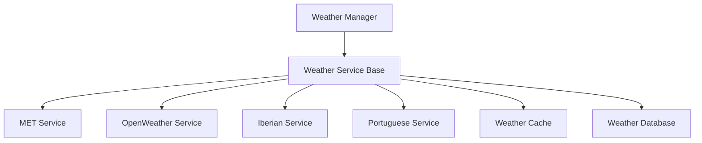
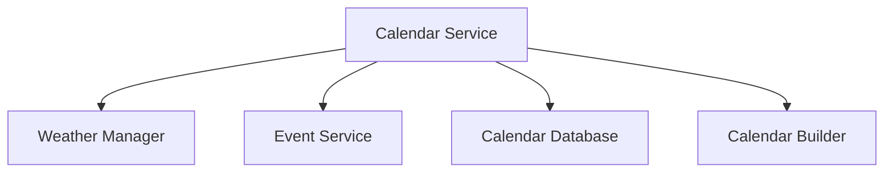
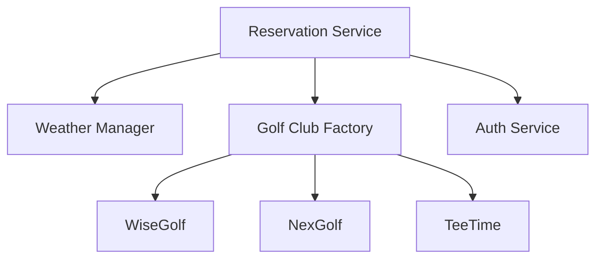
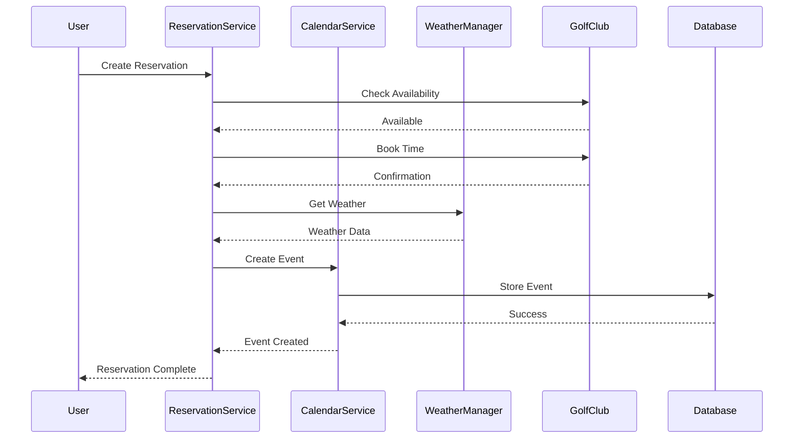

# Service Architecture

## Overview

GolfCal2's service architecture is designed around core services that handle specific aspects of the application's functionality. Each service follows a layered architecture with base classes, managers, and specific implementations.

## Service Layer Patterns

### Base Service Pattern

All services inherit from a base service class that provides common functionality:

```python
class BaseService(EnhancedLoggerMixin):
    """Base class for all services."""
    
    def __init__(self, config: AppConfig):
        self.config = config
        self._validate_config()
    
    @abstractmethod
    def _validate_config(self) -> None:
        """Validate service configuration."""
        pass
```

### Service Manager Pattern

Service managers coordinate multiple service implementations:

```python
class WeatherServiceManager(WeatherService):
    """Manager for handling multiple weather services."""
    
    def __init__(self, local_tz: ZoneInfo, utc_tz: ZoneInfo, config: Dict[str, Any]):
        self.services = [
            OpenWeatherService(local_tz, utc_tz, config, region="global"),
            MetWeatherService(local_tz, utc_tz, config),
            IberianWeatherService(local_tz, utc_tz, config),
            PortugueseWeatherService(local_tz, utc_tz, config)
        ]
    
    def get_weather(self, lat: float, lon: float, start_time: datetime, end_time: datetime) -> WeatherResponse:
        """Get weather data from all available services."""
        for service in self.services:
            try:
                return service.get_weather(lat, lon, start_time, end_time)
            except WeatherError:
                continue
        raise WeatherServiceUnavailable("No weather service available")
```

### Enhanced Logging

Services use enhanced logging capabilities through mixins:

```python
class EnhancedLoggerMixin:
    """Provides enhanced logging capabilities."""
    
    def set_log_context(self, **context):
        """Set logging context for service."""
        self._log_context = context
    
    def debug(self, msg: str, **kwargs):
        """Log debug message with context."""
        self._log(logging.DEBUG, msg, **kwargs)
```

## Service Implementations

### Weather Service

The weather service follows a layered architecture:



Key components:
- Weather Manager: Coordinates multiple services
- Base Service: Common functionality
- Specific Implementations: Regional services
- Cache Layer: Performance optimization
- Database Layer: Persistence

### Calendar Service

The calendar service manages events and integrates with weather:



Components:
- Calendar Service: Main coordination
- Event Service: External event handling
- Calendar Builder: ICS file generation
- Weather Integration: Forecast data

### Reservation Service

The reservation service handles bookings across different systems:



Components:
- Reservation Service: Main coordination
- Golf Club Factory: CRM system integration
- Auth Service: Authentication handling
- Weather Integration: Forecast data

## Service Integration

### Data Flow



### Error Handling

Services implement comprehensive error handling:

1. Service-Level Errors
   - Configuration errors
   - Initialization errors
   - Service unavailable

2. Integration Errors
   - API timeouts
   - Authentication failures
   - Data validation errors

3. Recovery Strategies
   - Automatic retries
   - Service fallbacks
   - Graceful degradation
``` 