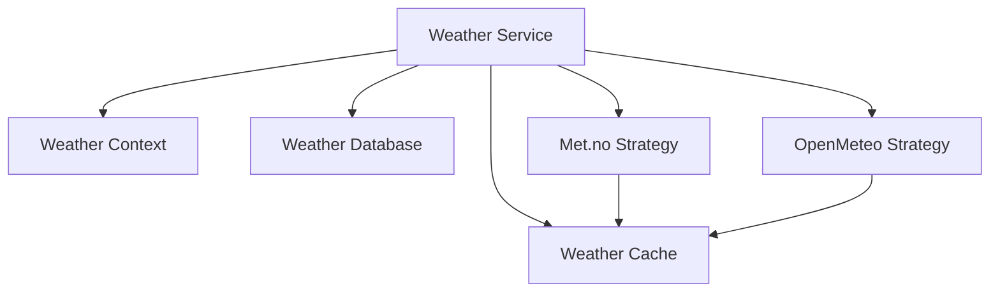
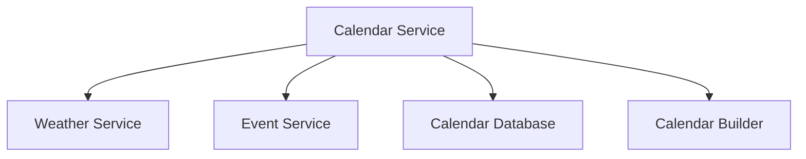
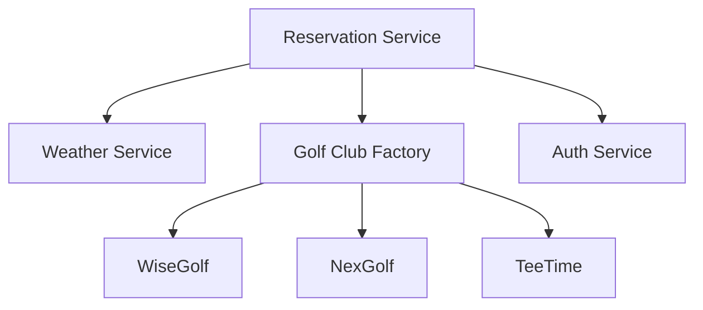
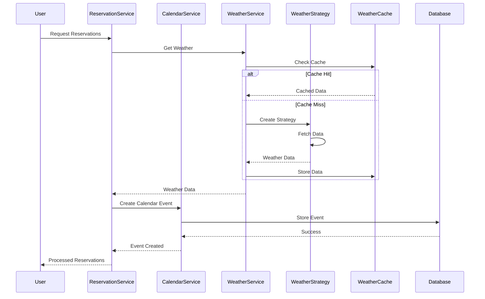

# Service Architecture

## Overview

GolfCal2's service architecture is designed around core services that handle specific aspects of the application's functionality. Each service follows a strategy pattern with base classes, concrete strategies, and context objects.

## Service Layer Patterns

### Strategy Pattern

Services use the strategy pattern to handle different implementations:

```python
class WeatherStrategy(ABC, LoggerMixin):
    """Base strategy for weather services."""
    
    service_type: str = "base"  # Should be overridden by subclasses
    
    def __init__(self, context: WeatherContext):
        """Initialize strategy."""
        super().__init__()
        self.context = context
        self.set_log_context(service=self.__class__.__name__.lower())
    
    @abstractmethod
    def get_weather(self) -> Optional[WeatherResponse]:
        """Get weather data for the given context."""
        pass
    
    @abstractmethod
    def get_expiry_time(self) -> datetime:
        """Get expiry time for cached weather data."""
        pass

    @abstractmethod
    def get_block_size(self, hours_ahead: float) -> int:
        """Get block size for forecast range."""
        pass
```

### Context Objects

Context objects encapsulate the data needed by strategies:

```python
class WeatherContext:
    """Context for weather data retrieval."""
    
    def __init__(
        self,
        lat: float,
        lon: float,
        start_time: datetime,
        end_time: datetime,
        local_tz: ZoneInfo,
        utc_tz: ZoneInfo,
        config: Dict[str, Any]
    ):
        self.lat = lat
        self.lon = lon
        self.start_time = start_time
        self.end_time = end_time
        self.local_tz = local_tz
        self.utc_tz = utc_tz
        self.config = config
```

### Enhanced Logging

Services use enhanced logging capabilities through mixins:

```python
class EnhancedLoggerMixin:
    """Provides enhanced logging capabilities."""
    
    def set_log_context(self, **context):
        """Set logging context for service."""
        self._log_context = context
    
    def debug(self, msg: str, **kwargs):
        """Log debug message with context."""
        self._log(logging.DEBUG, msg, **kwargs)
```

## Service Implementations

### Weather Service

The weather service follows a strategy pattern:



Key components:
- Weather Service: Strategy coordination
- Weather Context: Request context
- Concrete Strategies: Met.no and OpenMeteo
- Cache Layer: Performance optimization
- Database Layer: Persistence

### Calendar Service

The calendar service manages events and integrates with weather:



Components:
- Calendar Service: Main coordination
- Event Service: External event handling
- Calendar Builder: ICS file generation
- Weather Integration: Forecast data

### Reservation Service

The reservation service handles bookings across different systems:



Components:
- Reservation Service: Main coordination
- Golf Club Factory: CRM system integration
- Auth Service: Authentication handling
- Weather Integration: Forecast data

## Service Integration

### Data Flow



### Error Handling

Services implement comprehensive error handling:

1. Service-Level Errors
   - Configuration errors
   - Initialization errors
   - Service unavailable

2. Integration Errors
   - API timeouts
   - Rate limiting
   - Data validation errors

3. Recovery Strategies
   - Automatic retries
   - Service fallbacks
   - Cache utilization
   - Graceful degradation
``` 