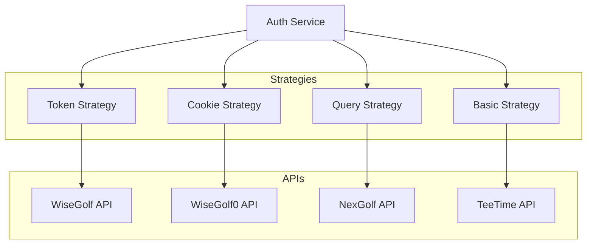
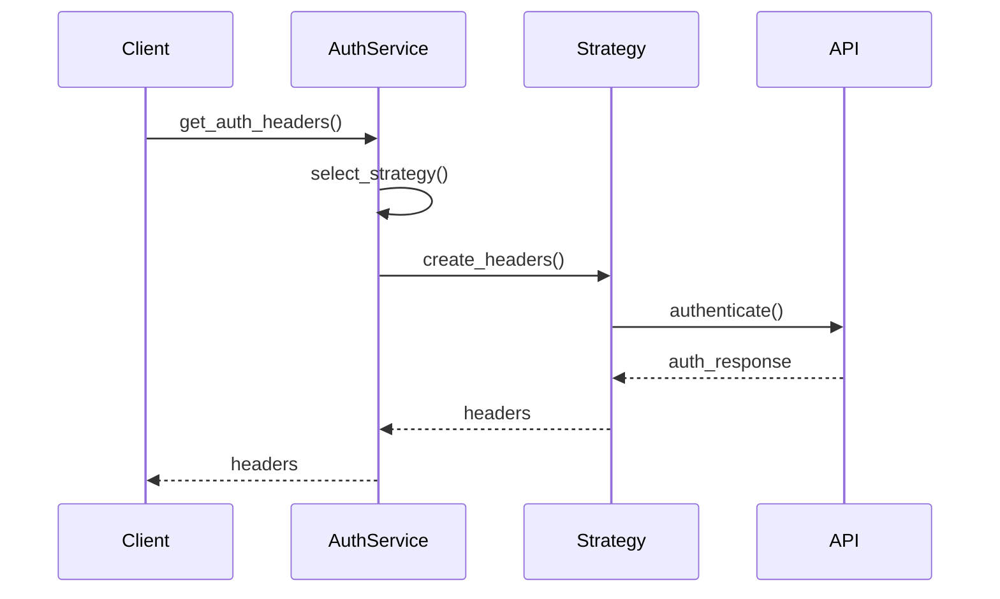
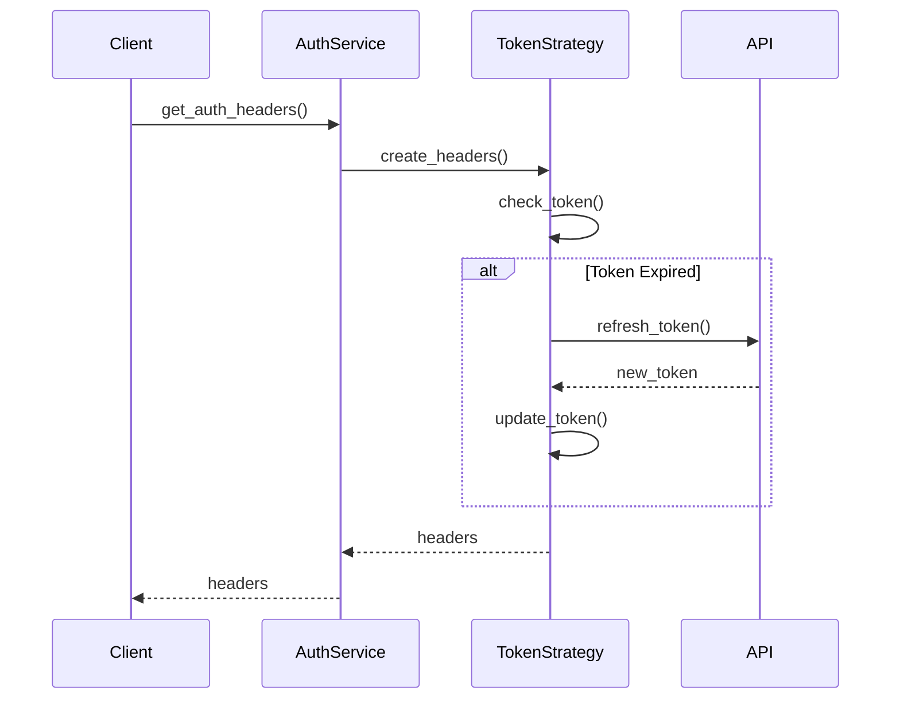

# Authentication Service

## Overview

The Authentication Service manages authentication for various golf club booking systems and external services. It provides a unified interface for handling different authentication methods while ensuring secure access to APIs.

## Architecture



## Core Components

### AuthService

The main service class that coordinates authentication:

```python
class AuthService:
    def __init__(self):
        self.strategies = {
            'token': TokenAuthStrategy(),
            'cookie': CookieAuthStrategy(),
            'query': QueryAuthStrategy(),
            'basic': BasicAuthStrategy()
        }
```

### Authentication Strategies

1. **Token Authentication**
   - Modern API authentication
   - Bearer token support
   - Token refresh handling
   - Used by WiseGolf

2. **Cookie Authentication**
   - Session-based authentication
   - Cookie management
   - Session refresh
   - Used by WiseGolf0

3. **Query Authentication**
   - URL parameter-based auth
   - Simple key-value pairs
   - Used by NexGolf

4. **Basic Authentication**
   - Username/password auth
   - Base64 encoding
   - Used by TeeTime

## Data Flow

### Authentication Flow



### Token Refresh Flow



## Configuration

The service requires configuration for each authentication type:

```yaml
auth:
  wisegolf:
    type: "token"
    client_id: "your-client-id"
    client_secret: "your-client-secret"
    
  wisegolf0:
    type: "cookie"
    session_timeout: 3600
    
  nexgolf:
    type: "query"
    api_key: "your-api-key"
    
  teetime:
    type: "basic"
    username: "your-username"
    password: "your-password"
```

## Usage Examples

### Token Authentication

```python
# Initialize service
auth_service = AuthService()

# Get headers for token auth
try:
    headers = auth_service.get_auth_headers(
        auth_type="token",
        config={
            "client_id": "your-client-id",
            "client_secret": "your-client-secret"
        }
    )
    response = requests.get(api_url, headers=headers)
except AuthError as e:
    handle_error(e)
```

### Cookie Authentication

```python
# Get headers for cookie auth
try:
    headers = auth_service.get_auth_headers(
        auth_type="cookie",
        config={
            "session_id": "your-session-id",
            "session_timeout": 3600
        }
    )
    response = requests.get(api_url, headers=headers)
except AuthError as e:
    handle_error(e)
```

## Best Practices

1. **Security**
   - Use HTTPS for all requests
   - Implement proper token storage
   - Handle sensitive data securely
   - Follow OAuth 2.0 best practices

2. **Token Management**
   - Implement token refresh
   - Handle token expiration
   - Secure token storage
   - Monitor token usage

3. **Error Handling**
   - Handle auth failures gracefully
   - Implement retry mechanisms
   - Log security events
   - Provide clear error messages

4. **Performance**
   - Cache auth tokens
   - Minimize auth requests
   - Handle rate limits
   - Monitor API usage

## Error Handling

The service implements comprehensive error handling:

1. **Authentication Errors**
   - `AuthError`: Base exception
   - `TokenError`: Token-related errors
   - `SessionError`: Session-related errors
   - `CredentialsError`: Invalid credentials

2. **API Errors**
   - `APIError`: Base API exception
   - `APITimeoutError`: Connection timeouts
   - `APIRateLimitError`: Rate limit exceeded

3. **Error Recovery**
   - Automatic token refresh
   - Session recovery
   - Retry mechanisms
   - Error aggregation

## Testing

The service includes comprehensive tests:

1. **Unit Tests**
   - Strategy implementation tests
   - Token management tests
   - Error handling tests

2. **Integration Tests**
   - End-to-end auth flow
   - Token refresh flow
   - API integration tests

3. **Security Tests**
   - Token validation
   - Session management
   - Error scenarios

## Related Documentation

- [Service Architecture](../../architecture/services.md)
- [Reservation Service](../reservation/README.md)
- [Security Guidelines](../../development/security.md) 