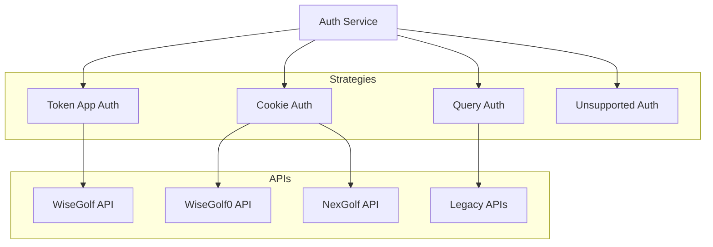
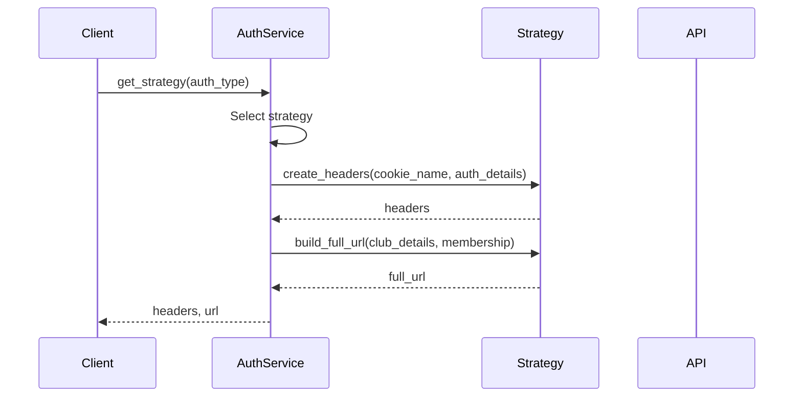

# Authentication Service

## Overview

The Authentication Service manages authentication for various golf club booking systems and external services. It provides a unified interface for handling different authentication methods while ensuring secure access to APIs.

## Architecture



## Core Components

### AuthService

The main service class that coordinates authentication:

```python
class AuthService:
    def __init__(self):
        self._strategies = {
            'token_appauth': TokenAppAuthStrategy(),
            'cookie': CookieAuthStrategy(),
            'query': QueryAuthStrategy()
        }
```

### Authentication Strategies

1. **Token App Authentication (token_appauth)**
   - Modern API authentication
   - Used by WiseGolf
   - Headers:
     ```http
     Authorization: <token>
     x-session-type: wisegolf
     Accept: application/json, text/plain, */*
     ```
   - URL format includes appauth parameter
   - Token validation and management

2. **Cookie Authentication (cookie)**
   - Session-based authentication
   - Used by WiseGolf0 and NexGolf
   - WiseGolf0 format:
     ```http
     Cookie: wisenetwork_session=<session_token>
     ```
   - NexGolf format:
     ```http
     Cookie: NGLOCALE=fi; JSESSIONID=<session_token>
     ```
   - Session management and renewal

3. **Query Authentication (query)**
   - URL parameter-based auth
   - Used by legacy systems
   - Headers:
     ```http
     Accept: application/json, text/plain, */*
     Content-Type: application/json
     ```
   - URL format: `<base_url>?token=<token>`
   - Optional cookie-based caching

4. **Unsupported Authentication**
   - Fallback strategy for unknown types
   - Returns empty headers
   - Logs unsupported auth type warnings

## Data Flow

### Authentication Flow



## Configuration

The service requires configuration for each authentication type:

```yaml
# Club configuration
clubs:
  wisegolf_club:
    type: "wisegolf"
    url: "https://api.wisegolf.club"
    auth_type: "token_appauth"
    
  wisegolf0_club:
    type: "wisegolf0"
    url: "https://legacy.wisegolf.club"
    shopURL: "https://shop.wisegolf.club"
    auth_type: "cookie"
    cookie_name: "wisenetwork_session"
    
  nexgolf_club:
    type: "nexgolf"
    url: "https://api.nexgolf.fi"
    auth_type: "cookie"
    cookie_name: "NGLOCALE=fi; JSESSIONID"

# User configuration
users:
  username:
    memberships:
      - club: "wisegolf_club"
        auth_details:
          token: "your-token"
          appauth: "your-appauth"
      - club: "nexgolf_club"
        auth_details:
          cookie_value: "your-session-id"
```

## Usage Examples

### Token App Authentication

```python
auth_service = AuthService()

# Get headers for token app auth
headers = auth_service.create_headers(
    auth_type="token_appauth",
    cookie_name="",
    auth_details={
        "token": "your-token"
    }
)

# Build full URL
url = auth_service.build_full_url(
    auth_type="token_appauth",
    club_details={"url": "https://api.example.com"},
    membership={"auth_details": {"appauth": "your-appauth"}}
)
```

### Cookie Authentication

```python
# Get headers for NexGolf cookie auth
headers = auth_service.create_headers(
    auth_type="cookie",
    cookie_name="NGLOCALE=fi; JSESSIONID",
    auth_details={
        "cookie_value": "your-session-id"
    }
)

# Build full URL for WiseGolf0
url = auth_service.build_full_url(
    auth_type="cookie",
    club_details={
        "type": "wisegolf0",
        "shopURL": "https://shop.example.com"
    },
    membership={}
)
```

## Error Handling

The service implements error handling for:

1. **Authentication Errors**
   - Missing required auth details
   - Invalid token format
   - Session expiration
   - Cookie validation errors

2. **URL Building Errors**
   - Missing required URLs
   - Invalid club configuration
   - Unsupported auth types

3. **Recovery Strategies**
   - Fallback to unsupported strategy
   - Detailed error logging
   - Clear error messages

## Integration with Base API

The authentication service integrates with the BaseAPI class:

```python
class BaseAPI:
    def __init__(self, base_url, auth_service, club_details, membership):
        # Initialize session
        self.session = self._create_session()
        
        # Get authentication headers
        auth_type = club_details.get('auth_type', 'token_appauth')
        cookie_name = club_details.get('cookie_name', '')
        self.headers = auth_service.create_headers(
            auth_type, cookie_name, membership['auth_details']
        )
        
        # Update session headers
        self.session.headers.update(self.headers)
        
        # Build authenticated URL
        self.full_url = auth_service.build_full_url(
            auth_type, club_details, membership
        )
``` 