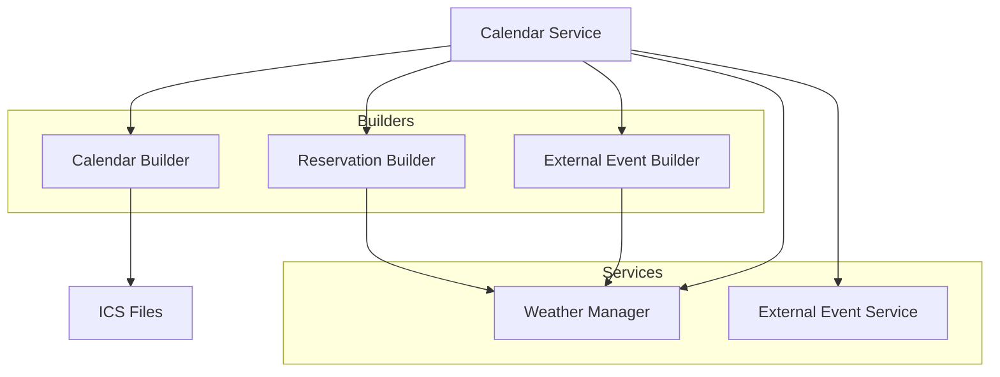
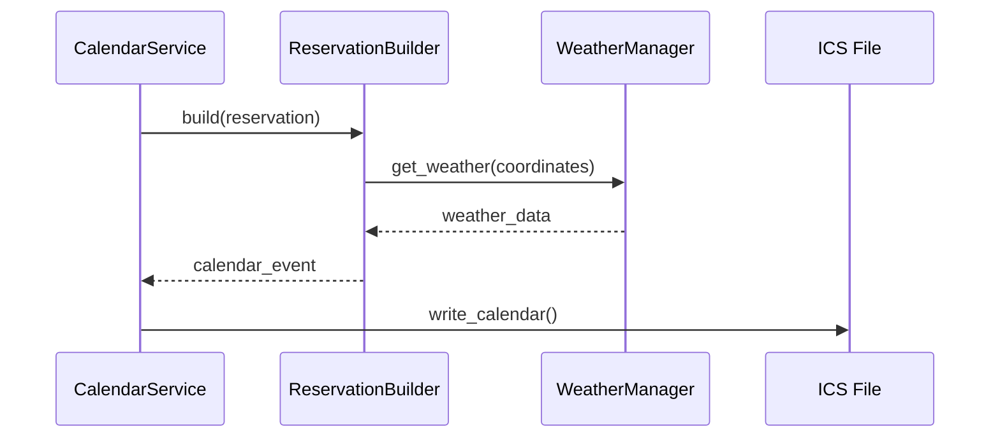
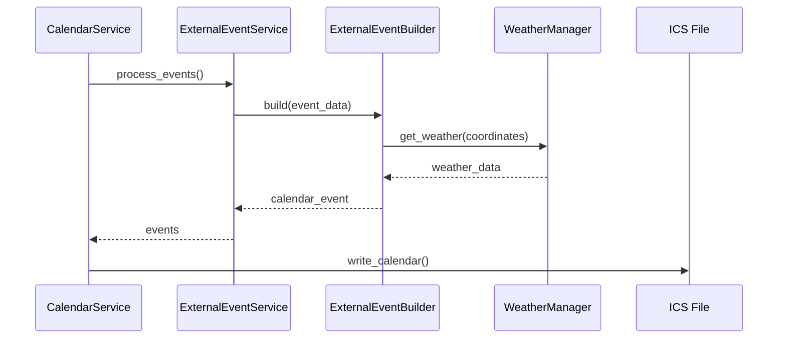

# Calendar Service

## Overview

The Calendar Service is a core component of GolfCal2 that manages the creation and maintenance of calendar files for golf reservations and external events. It provides a unified interface for handling different types of events and integrates with weather services to enrich event information.

## Architecture



## Core Components

### CalendarService

The main service class that coordinates calendar operations:

```python
class CalendarService(EnhancedLoggerMixin, CalendarHandlerMixin):
    def __init__(self, config: AppConfig, dev_mode: bool = False):
        self.weather_service = WeatherManager(...)
        self.external_event_service = ExternalEventService(...)
        self.calendar_builder = CalendarBuilder(...)
        self.reservation_builder = ReservationEventBuilder(...)
        self.external_builder = ExternalEventBuilder(...)
```

Key responsibilities:
- Managing calendar file creation
- Processing reservations and external events
- Coordinating with weather services
- Handling timezone conversions
- Error handling and logging

### Event Builders

1. **CalendarBuilder**
   - Creates base calendar structure
   - Handles calendar metadata
   - Manages file I/O operations

2. **ReservationEventBuilder**
   - Converts reservations to calendar events
   - Integrates weather information
   - Handles event formatting

3. **ExternalEventBuilder**
   - Processes external golf events
   - Supports recurring events
   - Integrates weather data

## Data Flow

### Reservation Processing



### External Event Processing



## Configuration

The service requires configuration for:

```yaml
calendar:
  ics_dir: "calendars"  # Directory for ICS files
  dev_mode: false       # Development mode flag
  timezone: "Europe/Helsinki"  # Default timezone
```

## Usage Examples

### Processing Reservations

```python
# Initialize services
calendar_service = CalendarService(config)

# Process user reservations
try:
    calendar_service.process_user_reservations(
        user_name="example_user",
        start_date=datetime.now(),
        end_date=datetime.now() + timedelta(days=30)
    )
except CalendarError as e:
    handle_error(e)
```

### Processing External Events

```python
# Process external events
try:
    calendar_service.process_external_events(
        user_name="example_user"
    )
except CalendarError as e:
    handle_error(e)
```

## Best Practices

1. **Calendar Management**
   - Use unique event IDs
   - Handle timezone conversions properly
   - Validate event data

2. **Event Processing**
   - Validate event data
   - Handle recurring events properly
   - Implement proper error handling
   - Use appropriate event builders

3. **Weather Integration**
   - Cache weather data appropriately
   - Handle service failures gracefully
   - Validate coordinate data
   - Format weather information consistently

4. **Performance**
   - Batch process events when possible
   - Implement proper caching
   - Handle large calendars efficiently
   - Optimize file I/O operations

## Error Handling

The service implements comprehensive error handling:

1. **Service Errors**
   - `CalendarError`: Base exception for calendar operations
   - `CalendarEventError`: Event processing errors
   - `CalendarWriteError`: File I/O errors

2. **Integration Errors**
   - `WeatherError`: Weather service failures
   - `ExternalEventError`: External event processing errors

3. **Error Recovery**
   - Graceful degradation on service failures
   - Automatic retries for transient errors
   - Detailed error logging
   - User-friendly error messages

## Testing

The service includes comprehensive tests:

1. **Unit Tests**
   - Event builder tests
   - Calendar processing tests
   - Weather integration tests

2. **Integration Tests**
   - End-to-end calendar creation
   - Weather service integration
   - External event processing

3. **Performance Tests**
   - Large calendar handling
   - Concurrent processing
   - I/O optimization

## Related Documentation

- [Service Architecture](../../architecture/services.md)
- [Weather Services](../weather/README.md)
- [External Events](../external-events/README.md) 