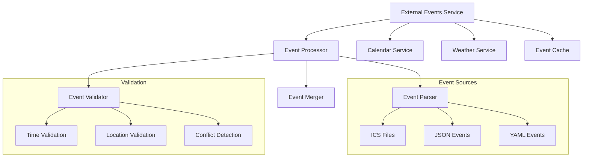

# External Events Service

## Overview

The External Events Service manages non-CRM events and their integration with the GolfCal2 calendar system. It handles event synchronization, weather data integration, and conflict detection with golf reservations.

## Architecture



## Components

### Event Processor

The event processor handles different event formats and sources:

```python
class EventProcessor:
    """Processes external events from various sources."""
    
    def __init__(self, config: EventConfig):
        self.config = config
        self.parsers = {
            'ics': ICSParser(),
            'json': JSONParser(),
            'yaml': YAMLParser()
        }
    
    def process_event(
        self,
        event_data: Union[str, Dict],
        source_type: str
    ) -> ExternalEvent:
        """Process event data from specified source."""
        parser = self.parsers[source_type]
        event = parser.parse(event_data)
        self._validate_event(event)
        return event
```

### Event Model

External events use a standardized data model:

```python
@dataclass
class ExternalEvent:
    id: str
    title: str
    start_time: datetime
    end_time: datetime
    location: Optional[Location]
    description: Optional[str]
    category: EventCategory
    priority: EventPriority
    weather_data: Optional[WeatherResponse] = None
```

### Event Categories

```python
class EventCategory(str, Enum):
    PERSONAL = 'personal'
    WORK = 'work'
    TRAVEL = 'travel'
    SPORTS = 'sports'
    SOCIAL = 'social'
    OTHER = 'other'
```

### Event Priority

```python
class EventPriority(int, Enum):
    LOW = 1
    NORMAL = 2
    HIGH = 3
    CRITICAL = 4
```

## Features

### 1. Event Import

Supports multiple import formats:
- ICS calendar files
- JSON event data
- YAML event data
- Manual event entry

### 2. Weather Integration

- Automatic weather data fetching for events with locations
- Weather-based event recommendations
- Weather alerts for outdoor events

### 3. Conflict Management

- Automatic conflict detection with golf reservations
- Priority-based conflict resolution
- Flexible scheduling recommendations
- Buffer time management

### 4. Calendar Integration

- Two-way synchronization with calendar service
- Event updates and modifications
- Recurring event support
- Timezone handling

## Configuration

Example configuration in `config.yaml`:
```yaml
external_events:
  enabled: true
  cache_path: "~/.golfcal2/cache/events"
  sources:
    ics:
      enabled: true
      watch_directory: "~/calendars"
      sync_interval: 300  # seconds
    json:
      enabled: true
      api_enabled: true
    yaml:
      enabled: true
      config_file: "events.yaml"
  
  categories:
    personal:
      color: "#4CAF50"
      icon: "person"
    work:
      color: "#2196F3"
      icon: "work"
    travel:
      color: "#FFC107"
      icon: "flight"
    sports:
      color: "#FF5722"
      icon: "sports"
    social:
      color: "#9C27B0"
      icon: "group"
    other:
      color: "#757575"
      icon: "event"
  
  conflict_handling:
    buffer_time: 60  # minutes
    auto_resolve: true
    priority_rules:
      - {category: "work", priority: 3}
      - {category: "travel", priority: 3}
      - {category: "sports", priority: 2}
      - {category: "social", priority: 1}
```

## Event File Format

Example event in YAML format:

```yaml
events:
  - title: "Team Meeting"
    start_time: "2024-02-09T10:00:00+02:00"
    end_time: "2024-02-09T11:30:00+02:00"
    category: "work"
    priority: 3
    location:
      name: "Office"
      coordinates:
        lat: 60.1699
        lon: 24.9384
    description: "Weekly team sync"
    
  - title: "Tennis Match"
    start_time: "2024-02-10T14:00:00+02:00"
    end_time: "2024-02-10T16:00:00+02:00"
    category: "sports"
    priority: 2
    location:
      name: "Tennis Club"
      coordinates:
        lat: 60.2031
        lon: 24.9627
    description: "Doubles match"
```

## Best Practices

### 1. Event Management
- Use consistent timezone handling
- Include location data when available
- Set appropriate priorities
- Add descriptive details

### 2. Conflict Resolution
- Set realistic buffer times
- Configure priority rules
- Handle recurring events properly
- Consider travel times

### 3. Weather Integration
- Include location data for outdoor events
- Configure weather alerts
- Set appropriate thresholds
- Handle missing weather data

### 4. Performance
- Use appropriate cache settings
- Configure sync intervals
- Handle large calendars
- Optimize event processing

## Related Documentation

- [Calendar Service](../calendar/README.md)
- [Weather Service](../weather/README.md)
- [Configuration Guide](../../deployment/configuration.md) 