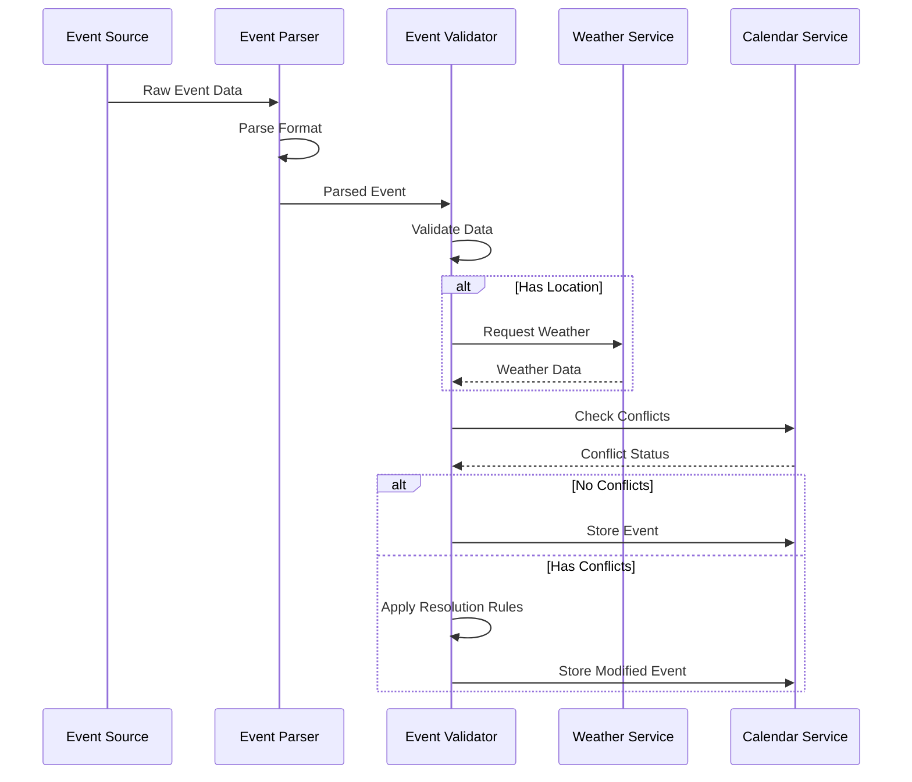

# Event Processing

## Overview

The event processing system in GolfCal2 handles the parsing, validation, and integration of external events from various sources. It ensures data consistency, handles conflicts, and integrates weather information.

## Event Processing Flow



## Event Parsers

### ICS Parser

Handles iCalendar format files:

```python
class ICSParser(EventParser):
    """Parser for iCalendar format."""
    
    def parse(self, data: str) -> List[ExternalEvent]:
        """Parse ICS data into events."""
        events = []
        calendar = Calendar.from_ical(data)
        
        for component in calendar.walk():
            if component.name == "VEVENT":
                event = ExternalEvent(
                    id=component.get('uid'),
                    title=component.get('summary'),
                    start_time=component.get('dtstart').dt,
                    end_time=component.get('dtend').dt,
                    location=self._parse_location(component.get('location')),
                    description=component.get('description'),
                    category=self._determine_category(component),
                    priority=self._determine_priority(component)
                )
                events.append(event)
        
        return events
```

### YAML Parser

Handles YAML format event files:

```python
class YAMLParser(EventParser):
    """Parser for YAML format."""
    
    def parse(self, data: str) -> List[ExternalEvent]:
        """Parse YAML data into events."""
        events = []
        yaml_data = yaml.safe_load(data)
        
        for event_data in yaml_data.get('events', []):
            event = ExternalEvent(
                id=str(uuid.uuid4()),
                title=event_data['title'],
                start_time=parse_datetime(event_data['start_time']),
                end_time=parse_datetime(event_data['end_time']),
                location=self._parse_location(event_data.get('location')),
                description=event_data.get('description'),
                category=EventCategory(event_data.get('category', 'other')),
                priority=EventPriority(event_data.get('priority', 2))
            )
            events.append(event)
        
        return events
```

## Validation

### Time Validation

```python
class TimeValidator:
    """Validates event time data."""
    
    def validate(self, event: ExternalEvent) -> List[ValidationError]:
        """Validate event times."""
        errors = []
        
        if event.start_time > event.end_time:
            errors.append(
                ValidationError("Start time must be before end time")
            )
        
        if event.start_time < datetime.now(event.start_time.tzinfo):
            errors.append(
                ValidationError("Cannot create events in the past")
            )
        
        return errors
```

### Location Validation

```python
class LocationValidator:
    """Validates event location data."""
    
    def validate(self, event: ExternalEvent) -> List[ValidationError]:
        """Validate event location."""
        errors = []
        
        if event.location:
            if not (-90 <= event.location.latitude <= 90):
                errors.append(
                    ValidationError("Invalid latitude")
                )
            if not (-180 <= event.location.longitude <= 180):
                errors.append(
                    ValidationError("Invalid longitude")
                )
        
        return errors
```

## Conflict Resolution

### Conflict Detection

```python
class ConflictDetector:
    """Detects conflicts between events."""
    
    def detect_conflicts(
        self,
        event: ExternalEvent,
        existing_events: List[Event]
    ) -> List[Conflict]:
        """Detect conflicts with existing events."""
        conflicts = []
        
        for existing in existing_events:
            if self._times_overlap(event, existing):
                conflicts.append(
                    Conflict(
                        event=event,
                        conflicting_event=existing,
                        type=self._determine_conflict_type(event, existing)
                    )
                )
        
        return conflicts
    
    def _times_overlap(self, event1: Event, event2: Event) -> bool:
        """Check if event times overlap."""
        return (
            event1.start_time < event2.end_time and
            event1.end_time > event2.start_time
        )
```

### Resolution Rules

```python
class ConflictResolver:
    """Resolves conflicts between events."""
    
    def resolve(
        self,
        conflict: Conflict,
        rules: Dict[str, Any]
    ) -> Resolution:
        """Resolve conflict based on rules."""
        if conflict.event.priority > conflict.conflicting_event.priority:
            return Resolution(
                action=ResolutionAction.KEEP_NEW,
                modified_event=conflict.event
            )
        
        elif conflict.event.priority < conflict.conflicting_event.priority:
            return Resolution(
                action=ResolutionAction.KEEP_EXISTING,
                modified_event=None
            )
        
        else:
            return self._apply_category_rules(conflict, rules)
```

## Weather Integration

### Weather Data Fetching

```python
class WeatherIntegrator:
    """Integrates weather data with events."""
    
    def __init__(self, weather_service: WeatherService):
        self.weather_service = weather_service
    
    def add_weather(self, event: ExternalEvent) -> ExternalEvent:
        """Add weather data to event."""
        if event.location:
            weather = self.weather_service.get_weather(
                location=event.location,
                start_time=event.start_time,
                end_time=event.end_time
            )
            
            if weather:
                event.weather_data = weather
                event.weather_alerts = self._check_weather_alerts(weather)
        
        return event
```

## Best Practices

### 1. Event Parsing
- Validate input data format
- Handle missing fields gracefully
- Convert timezones consistently
- Generate unique event IDs

### 2. Validation
- Check all required fields
- Validate time ranges
- Verify location data
- Handle validation errors

### 3. Conflict Management
- Use appropriate buffer times
- Consider event priorities
- Handle recurring events
- Document resolution decisions

### 4. Weather Integration
- Cache weather data appropriately
- Handle missing weather data
- Set appropriate alert thresholds
- Consider outdoor vs indoor events 