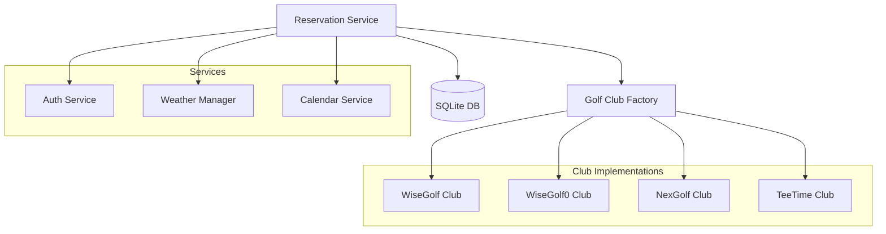
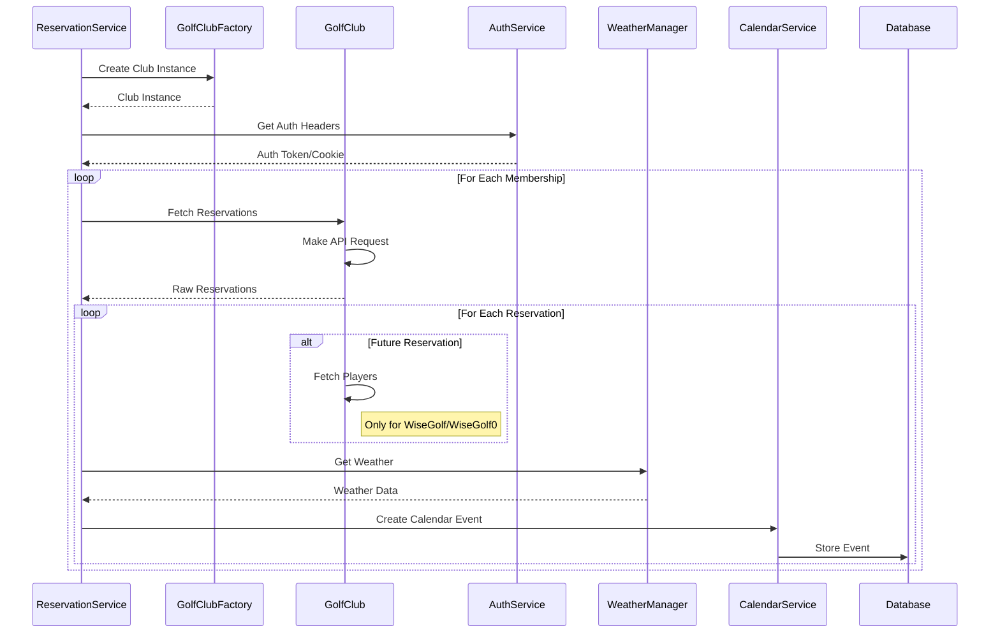

# Reservation Service

## Overview

The Reservation Service manages golf course reservations across multiple booking systems and golf clubs. It provides a unified interface for fetching, processing, and managing reservations while integrating with weather services and calendar systems.

## Architecture



## Core Components

### ReservationService

The main service class that coordinates reservation operations:

```python
class ReservationService(EnhancedLoggerMixin, ReservationHandlerMixin, CalendarHandlerMixin):
    def __init__(self, user_name: str, config: AppConfig):
        self.user_name = user_name
        self.config = config
        self.auth_service = AuthService()
        self.weather_service = WeatherManager()
        self.local_tz = ZoneInfo(config.timezone)
```

Key responsibilities:
- Fetching user reservations from multiple golf clubs
- Processing different booking system formats
- Integrating weather information
- Creating calendar events
- Handling timezone conversions
- Error handling and logging

### Golf Club Types

1. **WiseGolf**
   - Modern REST API
   - Token-based authentication
   - Separate API calls for reservations and players
   - AJAX API for reservations, REST API for players
   - Local time handling

2. **WiseGolf0**
   - Legacy booking system
   - Cookie-based authentication
   - Similar to WiseGolf but with different endpoints
   - Separate player data fetching
   - Local time handling

3. **NexGolf**
   - Nordic booking system
   - Query parameter authentication
   - Single API endpoint with date range
   - Players included in reservation data
   - UTC time with timezone info

4. **TeeTime**
   - Generic booking system
   - Multiple authentication methods
   - Single API endpoint
   - Basic reservation features
   - Local time handling

## Data Flow

### Reservation Processing



## Configuration

The service requires configuration for:

```yaml
# Club configuration
clubs:
  wisegolf_club:
    type: "wisegolf"
    url: "https://api.wisegolf.club"
    timezone: "Europe/Helsinki"
    coordinates:
      lat: 60.1234
      lon: 24.5678

  wisegolf0_club:
    type: "wisegolf0"
    url: "https://legacy.wisegolf.club"
    restUrl: "https://api.wisegolf.club"
    timezone: "Europe/Helsinki"

  nexgolf_club:
    type: "nexgolf"
    url: "https://api.nexgolf.fi"
    timezone: "Europe/Helsinki"

  teetime_club:
    type: "teetime"
    url: "https://api.teetime.com"
    timezone: "Europe/Helsinki"

# User configuration
users:
  username:
    memberships:
      - club: "wisegolf_club"
        auth:
          type: "token"
          token: "your-token"
      - club: "nexgolf_club"
        auth:
          type: "cookie"
          member_id: "12345"
          pin: "1234"
```

## Error Handling

The service implements comprehensive error handling:

1. API Errors
   - Timeout handling
   - Rate limit handling
   - Authentication failures
   - Invalid responses

2. Data Processing Errors
   - Invalid date formats
   - Missing required fields
   - Player data parsing errors
   - Timezone conversion errors

3. Recovery Strategies
   - Automatic retries
   - Graceful degradation
   - Error aggregation
   - Detailed logging

## Usage Examples

### List Available Courses

```python
service = ReservationService("username", config)
courses = service.list_courses()  # User's courses
all_courses = service.list_courses(include_all=True)  # All configured courses
```

### Process User Reservations

```python
service = ReservationService("username", config)
calendar, reservations = service.process_user(
    user_name="username",
    user_config=config.users["username"],
    past_days=1  # Include reservations from yesterday
)
``` 