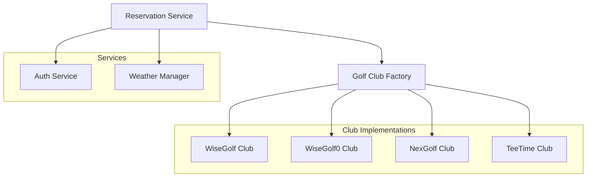
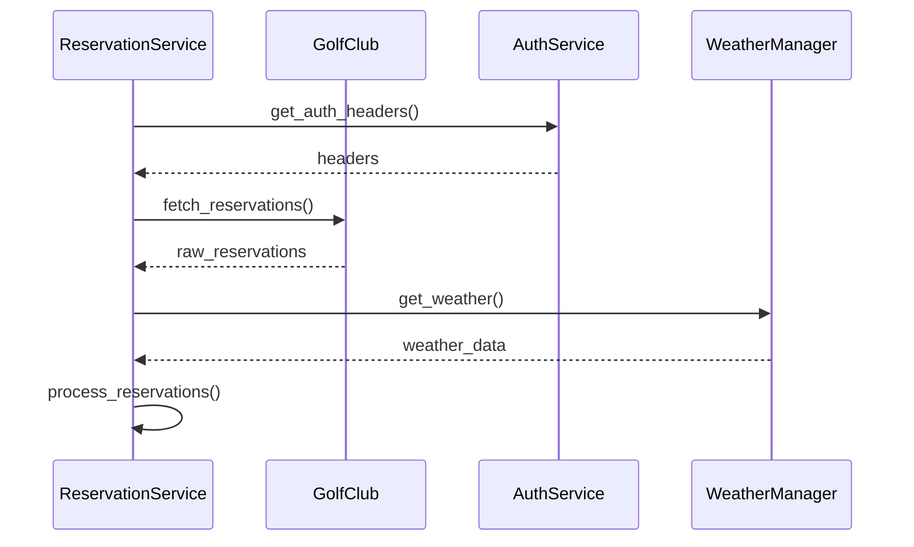

# Reservation Service

## Overview

The Reservation Service manages golf course reservations across multiple booking systems and golf clubs. It provides a unified interface for fetching, processing, and managing reservations while integrating with weather services and calendar systems.

## Architecture



## Core Components

### ReservationService

The main service class that coordinates reservation operations:

```python
class ReservationService(EnhancedLoggerMixin, ReservationHandlerMixin):
    def __init__(self, user_name: str, config: AppConfig):
        self.auth_service = AuthService()
        self.weather_service = WeatherManager(...)
```

Key responsibilities:
- Managing user reservations
- Processing different booking systems
- Integrating weather information
- Handling timezone conversions
- Error handling and logging

### Golf Club Types

1. **WiseGolf**
   - Modern booking system
   - Real-time availability
   - Token-based authentication

2. **WiseGolf0**
   - Legacy booking system
   - Cookie-based authentication
   - Basic availability checks

3. **NexGolf**
   - Nordic booking system
   - Query parameter authentication
   - Advanced tee time management

4. **TeeTime**
   - Generic booking system
   - Multiple authentication methods
   - Basic reservation features

## Data Flow

### Reservation Processing



## Configuration

The service requires configuration for:

```yaml
users:
  example_user:
    timezone: "Europe/Helsinki"
    memberships:
      - club: "ExampleGolf"
        type: "wisegolf"
        auth:
          username: "user"
          password: "pass"
```

## Usage Examples

### Listing Reservations

```python
# Initialize service
reservation_service = ReservationService("example_user", config)

# List reservations
try:
    reservations = reservation_service.list_reservations(
        past_days=7,
        future_days=30
    )
    for reservation in reservations:
        print(f"Reservation: {reservation.club} at {reservation.start_time}")
except APIError as e:
    handle_error(e)
```

### Processing Weather Data

```python
# Process weather for reservation
try:
    weather = reservation_service.weather_service.get_weather(
        coordinates=club_config['coordinates'],
        start_time=reservation.start_time,
        end_time=reservation.end_time
    )
    print(f"Weather: {weather.temperature}°C, {weather.description}")
except WeatherError as e:
    handle_error(e)
```

## Best Practices

1. **Reservation Management**
   - Validate reservation data
   - Handle timezone conversions properly
   - Implement proper error handling
   - Use appropriate club implementations

2. **Authentication**
   - Use secure authentication methods
   - Handle token expiration
   - Implement proper error recovery
   - Follow security best practices

3. **Weather Integration**
   - Cache weather data appropriately
   - Handle service failures gracefully
   - Validate coordinate data
   - Format weather information consistently

4. **Performance**
   - Batch process reservations
   - Implement proper caching
   - Handle rate limits
   - Optimize API calls

## Error Handling

The service implements comprehensive error handling:

1. **API Errors**
   - `APIError`: Base exception for API operations
   - `APITimeoutError`: Connection timeouts
   - `APIRateLimitError`: Rate limit exceeded
   - `APIResponseError`: Invalid responses

2. **Integration Errors**
   - `WeatherError`: Weather service failures
   - `AuthError`: Authentication failures
   - `ConfigError`: Configuration issues

3. **Error Recovery**
   - Automatic retries for transient errors
   - Graceful degradation on service failures
   - Detailed error logging
   - User-friendly error messages

## Testing

The service includes comprehensive tests:

1. **Unit Tests**
   - Club implementation tests
   - Reservation processing tests
   - Weather integration tests

2. **Integration Tests**
   - End-to-end reservation flow
   - Authentication flow
   - Weather service integration

3. **Performance Tests**
   - Rate limit handling
   - Concurrent processing
   - API optimization

## Related Documentation

- [Service Architecture](../../architecture/services.md)
- [Weather Services](../weather/README.md)
- [Authentication](../auth/README.md) 