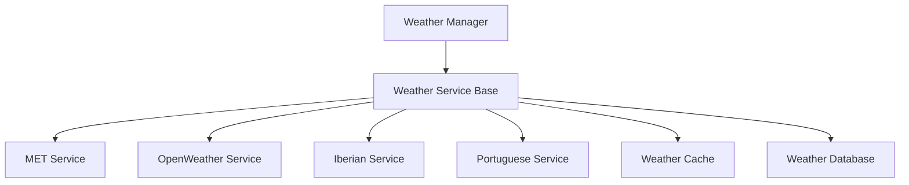

# Weather Service

## Overview

The weather service provides weather data for golf reservations and events through multiple providers. It uses a layered architecture with caching and database persistence.

## Architecture



## Components

### Base Service

The base weather service defines the core interface:

```python
class WeatherService(EnhancedLoggerMixin):
    """Base class for weather services."""
    
    def __init__(self, local_tz, utc_tz):
        self.local_tz = local_tz
        self.utc_tz = utc_tz
    
    def get_weather(self, lat: float, lon: float, start_time: datetime, end_time: datetime) -> WeatherResponse:
        """Get weather data for location and time range."""
        data = self._fetch_forecasts(lat, lon, start_time, end_time)
        return WeatherResponse(data=data, expires=self.get_expiry_time())
    
    def get_block_size(self, hours_ahead: float) -> int:
        """Get forecast block size based on forecast time."""
        raise NotImplementedError
```

### Weather Manager

The manager coordinates multiple weather services:

```python
class WeatherServiceManager(WeatherService):
    """Manager for handling multiple weather services."""
    
    def __init__(self, local_tz: ZoneInfo, utc_tz: ZoneInfo, config: Dict[str, Any]):
        self.services = [
            OpenWeatherService(local_tz, utc_tz, config, region="global"),
            MetWeatherService(local_tz, utc_tz, config),
            IberianWeatherService(local_tz, utc_tz, config),
            PortugueseWeatherService(local_tz, utc_tz, config)
        ]
    
    def get_weather(self, lat: float, lon: float, start_time: datetime, end_time: datetime) -> WeatherResponse:
        """Get weather data from all available services."""
        all_data = []
        latest_expiry = None
        
        for service in self.services:
            try:
                response = service.get_weather(lat, lon, start_time, end_time)
                if response and response.data:
                    all_data.extend(response.data)
                    if latest_expiry is None or response.expires > latest_expiry:
                        latest_expiry = response.expires
            except WeatherError:
                continue
        
        if not all_data:
            raise WeatherServiceUnavailable("No weather service available")
        
        return WeatherResponse(data=all_data, expires=latest_expiry or self.get_expiry_time())
```

### Weather Cache

The caching layer optimizes performance:

```python
class WeatherCache:
    """Cache for weather data."""
    
    def __init__(self, max_age: int = 3600):
        self.max_age = max_age
        self._cache = {}
    
    def get(self, coordinates: Dict[str, float], time: datetime) -> Optional[WeatherData]:
        """Get cached weather data if available and fresh."""
        key = self._make_key(coordinates, time)
        if key in self._cache:
            data, timestamp = self._cache[key]
            if datetime.now() - timestamp < timedelta(seconds=self.max_age):
                return data
        return None
    
    def set(self, coordinates: Dict[str, float], time: datetime, data: WeatherData) -> None:
        """Cache weather data."""
        key = self._make_key(coordinates, time)
        self._cache[key] = (data, datetime.now())
```

### Weather Database

The database layer provides persistence:

```python
class WeatherDatabase:
    """Database for weather data."""
    
    def __init__(self, db_path: str):
        self.db_path = db_path
        self._init_db()
    
    def store_weather(self, location: str, data: WeatherData) -> None:
        """Store weather data in database."""
        with sqlite3.connect(self.db_path) as conn:
            cursor = conn.cursor()
            cursor.execute(
                """
                INSERT OR REPLACE INTO weather (
                    location, time, temperature, precipitation,
                    wind_speed, wind_direction, symbol, expires
                ) VALUES (?, ?, ?, ?, ?, ?, ?, ?)
                """,
                (location, data.time, data.temperature, data.precipitation,
                 data.wind_speed, data.wind_direction, data.symbol, data.expires)
            )
```

## Data Types

### Weather Data

```python
@dataclass
class WeatherData:
    """Weather forecast data."""
    elaboration_time: datetime
    temperature: float  # Celsius
    precipitation_probability: float  # 0-100%
    wind_speed: float  # meters/second
    wind_direction: float  # degrees (0-360)
    weather_symbol: str
    cloud_coverage: Optional[float] = None  # 0-100%
    thunder_probability: Optional[float] = None  # 0-100%
```

### Weather Response

```python
@dataclass
class WeatherResponse:
    """Weather service response."""
    data: List[WeatherData]
    expires: datetime
```

## Service Providers

Each weather service provider implements the base interface:

1. [MET.no Service](providers/met.md)
   - Nordic region coverage
   - High accuracy for Scandinavian countries

2. [OpenWeather Service](providers/openweather.md)
   - Global coverage
   - Paid service with API key

3. [Iberian Service](providers/iberian.md)
   - Spain coverage
   - Government weather service

4. [Portuguese Service](providers/portuguese.md)
   - Portugal coverage
   - Government weather service

## Error Handling

The service implements comprehensive error handling:

1. Service Errors
   - `WeatherServiceUnavailable`: No service available
   - `WeatherDataError`: Invalid weather data
   - `WeatherAPIError`: API communication error

2. Recovery Strategies
   - Automatic service fallback
   - Cache utilization
   - Graceful degradation

## Configuration

```yaml
weather:
  cache_duration: 3600  # seconds
  database_path: "weather.db"
  providers:
    met:
      user_agent: "GolfCal2/0.6.0"
      timeout: 10
    openweather:
      api_key: "your-key"
      timeout: 10
    aemet:
      api_key: "your-key"
      timeout: 15
    ipma:
      enabled: true
      timeout: 10
``` 