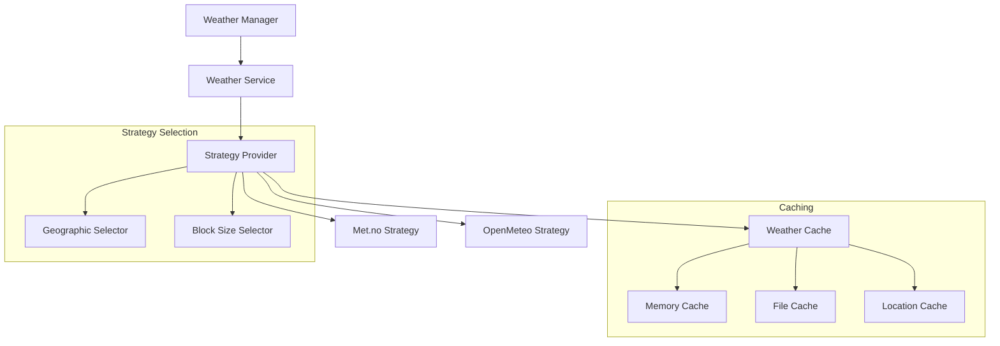

# Weather Service

## Overview

The weather service provides weather data for golf reservations and events through a strategy pattern implementation. It uses a layered architecture with caching and provider selection based on geographic location, offering region-specific weather data with automatic fallback mechanisms.

## Architecture



## Strategy Selection

The Weather Service selects strategies based on geographic location:

1. Nordic Region (55°N-71°N, 4°E-32°E):
   - Primary: Met.no (high-accuracy Nordic forecasts)
   - Fallback: OpenMeteo

2. All Other Regions:
   - Primary: OpenMeteo (global coverage)
   - No fallback needed (reliable global coverage)

## Components

### Weather Service

The base weather service implements the strategy pattern:

```python
class WeatherService:
    """Weather service using strategy pattern."""
    
    def __init__(self, config: WeatherConfig):
        self.config = config
        self.cache = WeatherCache(config.cache_path)
        self.strategies = {
            'met': MetWeatherStrategy(config.met),
            'openmeteo': OpenMeteoStrategy(config.openmeteo)
        }
    
    def get_weather(
        self,
        location: Location,
        start_time: datetime,
        end_time: datetime,
        block_size: Optional[BlockSize] = None
    ) -> WeatherResponse:
        """Get weather data using appropriate strategy."""
        strategy = self._select_strategy(location)
        return strategy.get_weather(location, start_time, end_time, block_size)
        
    def _select_strategy(self, location: Location) -> WeatherStrategy:
        """Select appropriate strategy based on location."""
        if self._is_nordic_region(location):
            return self.strategies['met']
        return self.strategies['openmeteo']
```

### Strategy Implementations

1. Met.no Strategy (Nordic)
   - High-accuracy forecasts for Nordic regions
   - No API key required
   - User-Agent required
   - 1-second request interval
   - Block sizes: 1h, 6h, 12h
   - Proprietary weather codes mapped to internal codes

2. OpenMeteo Strategy (Global)
   - Global coverage with flexible resolution
   - No API key required
   - 10,000 requests/day limit
   - WMO weather codes
   - Block sizes: 1h, 3h, 6h
   - Automatic unit conversion

### Caching System

The service implements a multi-layer caching system:

1. Memory Cache:
   - Short-term response caching
   - Strategy-specific durations
   - Request deduplication

2. File Cache:
   - JSON-based persistent storage
   - Location and strategy-based organization
   - Automatic expiration

3. Location Cache:
   - Coordinate validation
   - Region detection
   - Strategy selection optimization

## Data Format

All strategies return standardized weather data:

```python
@dataclass
class WeatherData:
    temperature: float              # Celsius
    precipitation: float           # mm/h
    precipitation_probability: float # 0-100%
    wind_speed: float             # m/s
    wind_direction: float         # Degrees (0-360)
    symbol: WeatherCode           # Internal weather code enum
    elaboration_time: datetime    # UTC
    thunder_probability: float    # 0-100%
    block_size: BlockSize         # Forecast block size enum
```

## Error Handling

The service implements comprehensive error handling:

1. Strategy Errors
   - Network connectivity issues
   - Rate limiting
   - Invalid coordinates
   - Parse errors
   - Missing data

2. Recovery Mechanisms
   - Automatic strategy fallback
   - Cache utilization
   - Exponential backoff
   - Graceful degradation
   - Detailed error logging

## Configuration

Example configuration in `config.yaml`:
```yaml
weather:
  cache_duration: 3600  # seconds
  cache_path: "~/.golfcal2/cache/weather"
  providers:
    met:
      user_agent: "GolfCal2/1.0.0"
      timeout: 10
      block_sizes: ["1h", "6h", "12h"]
    openmeteo:
      timeout: 10
      block_sizes: ["1h", "3h", "6h"]
```

## Related Documentation

- [Weather Service APIs](../../api/weather/README.md)
- [Weather Data Models](data-models.md)
- [Service Architecture](../../architecture/services.md) 