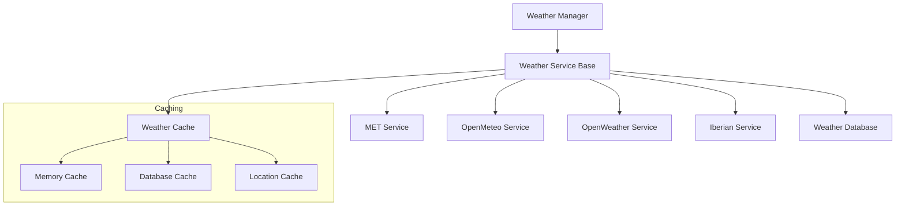

# Weather Service

## Overview

The weather service provides weather data for golf reservations and events through multiple providers. It uses a layered architecture with caching and database persistence, offering region-specific weather data with automatic fallback mechanisms.

## Architecture



## Service Selection

The Weather Manager selects services based on geographic location:

1. Nordic Region (55°N-72°N, 4°E-32°E):
   - Primary: MET.no (high-accuracy Nordic forecasts)
   - Fallback: OpenMeteo

2. Iberian Region (Spain and territories):
   - Primary: AEMET (municipality-based forecasts)
   - Fallback: OpenMeteo

3. All Other Regions:
   - Primary: OpenMeteo (global coverage)
   - Fallback: OpenWeather

## Components

### Base Service

The base weather service defines the core interface:

```python
class WeatherService(EnhancedLoggerMixin):
    """Base class for weather services."""
    
    def __init__(self, local_tz: ZoneInfo, utc_tz: ZoneInfo):
        self.local_tz = local_tz
        self.utc_tz = utc_tz
        
        # Initialize caching
        self.cache = WeatherResponseCache(os.path.join(data_dir, 'weather_cache.db'))
        self.location_cache = WeatherLocationCache(os.path.join(data_dir, 'weather_locations.db'))
    
    def get_weather(
        self,
        lat: float,
        lon: float,
        start_time: datetime,
        end_time: datetime,
        club: Optional[str] = None
    ) -> Optional[WeatherResponse]:
        """Get weather data for location and time range."""
        data = self._fetch_forecasts(lat, lon, start_time, end_time)
        return WeatherResponse(data=data, expires=self.get_expiry_time())
```

### Service Implementations

1. MET.no Service (Nordic)
   - High-accuracy forecasts for Nordic regions
   - No API key required
   - 1-second request interval
   - 6-hour cache duration
   - Proprietary weather codes mapped to internal codes

2. OpenMeteo Service (Global)
   - Global coverage with hourly resolution
   - No API key required
   - 10,000 requests/day limit
   - WMO weather codes
   - 1-hour cache duration
   - Automatic unit conversion

3. OpenWeather Service (Global Fallback)
   - Global coverage with 3-hour resolution
   - API key required
   - 60 calls/minute limit
   - Region-specific configurations
   - SQLite-based caching
   - Enhanced error handling

4. AEMET Service (Iberian)
   - Spain and territories coverage
   - Municipality-based forecasts
   - API key required
   - Multiple forecast ranges (hourly/6-hourly/daily)
   - 90-day municipality cache
   - Day/night condition support

### Caching System

The service implements a multi-layer caching system:

1. Memory Cache:
   - Short-term response caching
   - Configurable duration
   - Request deduplication

2. Database Cache:
   - Long-term forecast storage
   - Location-based caching
   - Service-specific schemas
   - Automatic expiration

3. Location Cache:
   - Municipality and coordinate caching
   - 90-day retention
   - Automatic updates

## Data Format

All services return standardized weather data:

```python
@dataclass
class WeatherData:
    temperature: float              # Celsius
    precipitation: float           # mm/h
    precipitation_probability: float # 0-100%
    wind_speed: float             # m/s
    wind_direction: float         # Degrees (0-360)
    symbol: str                   # Internal weather code
    elaboration_time: datetime    # UTC
    thunder_probability: float    # 0-100%
    block_duration: timedelta     # Forecast block duration
```

## Error Handling

The service implements comprehensive error handling:

1. Service Errors
   - Network connectivity issues
   - Authentication failures
   - Rate limiting
   - Invalid coordinates
   - Parse errors
   - Missing data

2. Recovery Strategies
   - Automatic service fallback
   - Cache utilization
   - Exponential backoff
   - Graceful degradation
   - Detailed error logging

## Configuration

Example configuration in `config.yaml`:
```yaml
weather:
  cache_duration: 3600  # seconds
  database_path: "weather.db"
  providers:
    met:
      user_agent: "GolfCal2/1.0"
      timeout: 10
    openmeteo:
      timeout: 10
    openweather:
      api_key: "your-key"
      timeout: 10
      regions:
        global:
          cache_duration: 3600
        nordic:
          cache_duration: 7200
    aemet:
      api_key: "your-key"
      timeout: 10
```

## Related Documentation

- [Weather Service APIs](../../api/weather/README.md)
- [Weather Data Models](data-models.md)
- [Service Architecture](../../architecture/services.md) 