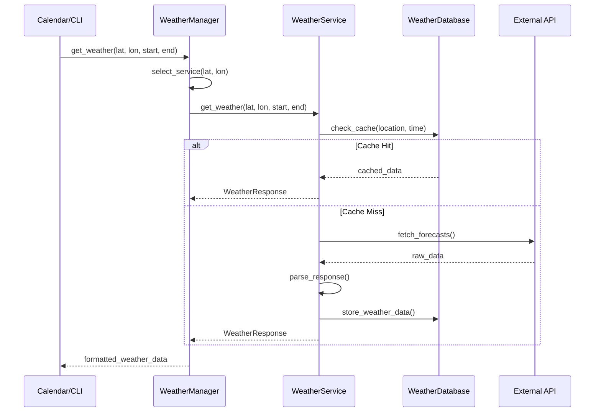
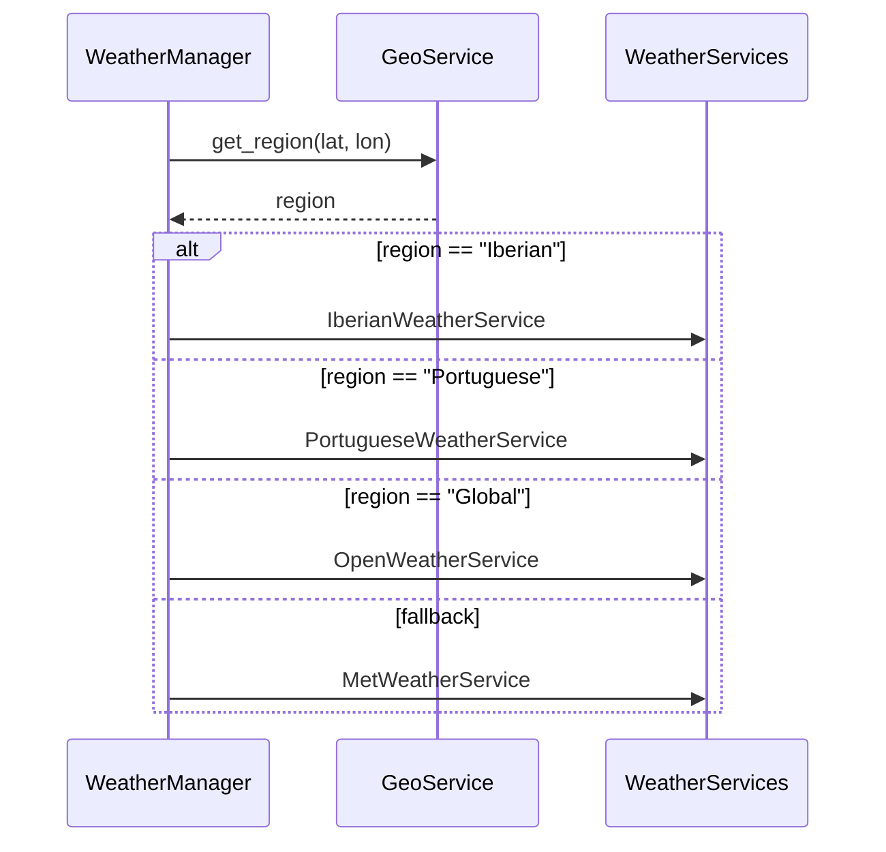
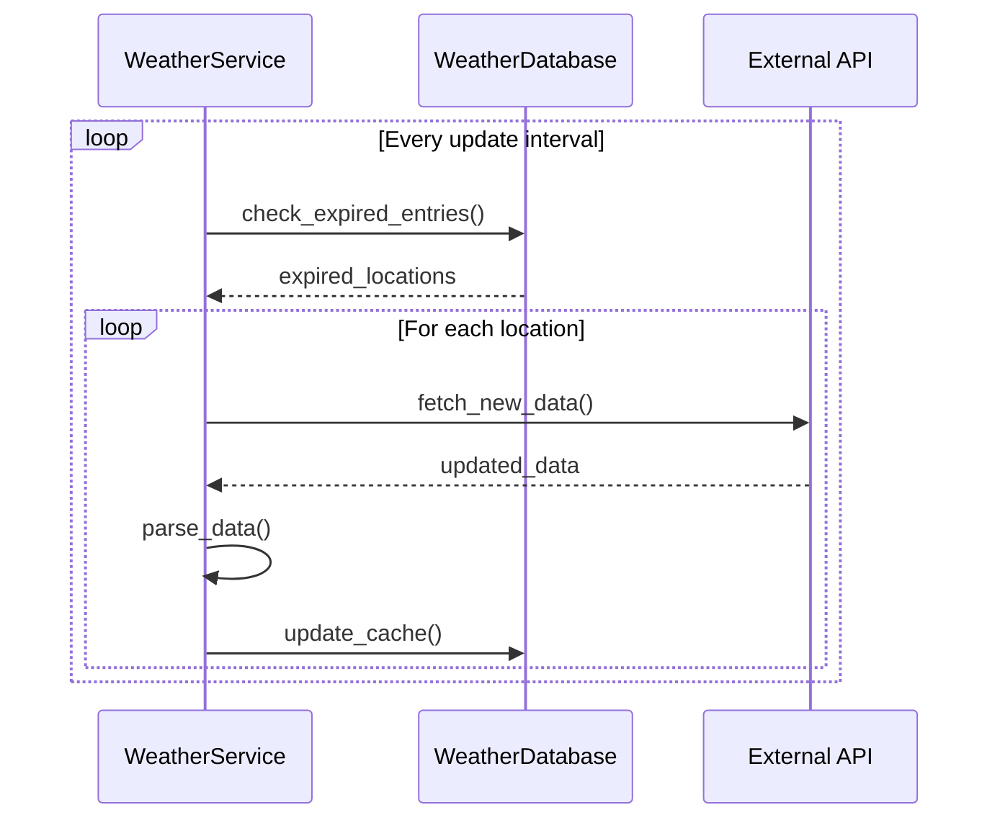
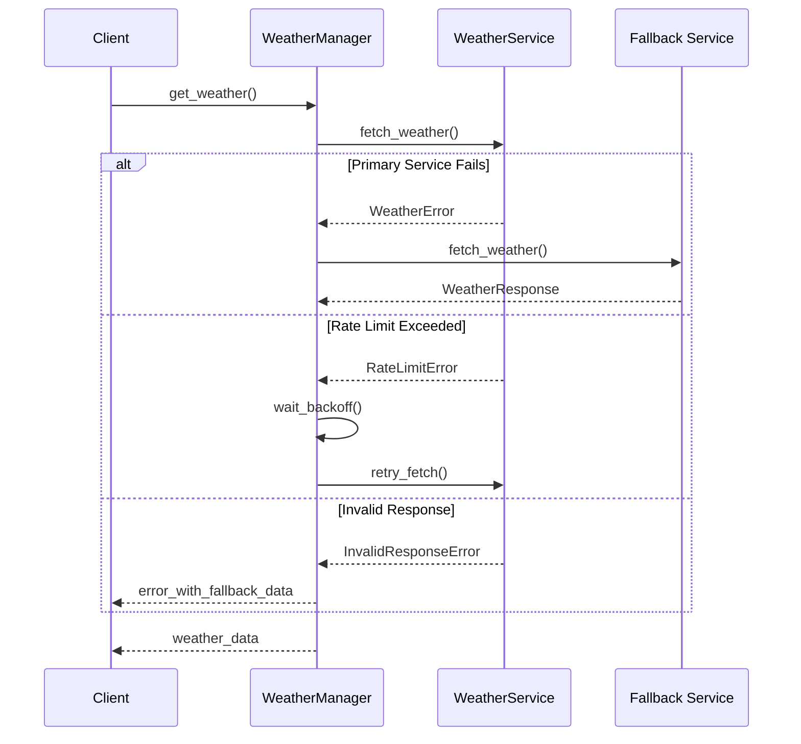

# Weather Data Flow

## Weather Request Flow

```mermaid
sequenceDiagram
    participant C as Calendar/CLI
    participant WM as WeatherManager
    participant WS as WeatherService
    participant DB as WeatherDatabase
    participant API as External API

    C->>WM: get_weather(lat, lon, start, end)
    WM->>WM: select_service(lat, lon)
    WM->>WS: get_weather(lat, lon, start, end)
    
    WS->>DB: check_cache(location, time)
    
    alt Cache Hit
        DB-->>WS: cached_data
        WS-->>WM: WeatherResponse
    else Cache Miss
        WS->>API: fetch_forecasts()
        API-->>WS: raw_data
        WS->>WS: parse_response()
        WS->>DB: store_weather_data()
        WS-->>WM: WeatherResponse
    end
    
    WM-->>C: formatted_weather_data
```

## Service Selection Flow

```mermaid
sequenceDiagram
    participant WM as WeatherManager
    participant GEO as GeoService
    participant WS as WeatherServices
    
    WM->>GEO: get_region(lat, lon)
    GEO-->>WM: region
    
    alt region == "Iberian"
        WM->>WS: IberianWeatherService
    else region == "Portuguese"
        WM->>WS: PortugueseWeatherService
    else region == "Global"
        WM->>WS: OpenWeatherService
    else fallback
        WM->>WS: MetWeatherService
    end
```

## Data Update Flow

```mermaid
sequenceDiagram
    participant WS as WeatherService
    participant DB as WeatherDatabase
    participant API as External API
    
    loop Every update interval
        WS->>DB: check_expired_entries()
        DB-->>WS: expired_locations
        
        loop For each location
            WS->>API: fetch_new_data()
            API-->>WS: updated_data
            WS->>WS: parse_data()
            WS->>DB: update_cache()
        end
    end
```

## Error Handling Flow

```mermaid
sequenceDiagram
    participant C as Client
    participant WM as WeatherManager
    participant WS as WeatherService
    participant FB as Fallback Service
    
    C->>WM: get_weather()
    WM->>WS: fetch_weather()
    
    alt Primary Service Fails
        WS-->>WM: WeatherError
        WM->>FB: fetch_weather()
        FB-->>WM: WeatherResponse
    else Rate Limit Exceeded
        WS-->>WM: RateLimitError
        WM->>WM: wait_backoff()
        WM->>WS: retry_fetch()
    else Invalid Response
        WS-->>WM: InvalidResponseError
        WM-->>C: error_with_fallback_data
    end
    
    WM-->>C: weather_data
``` 